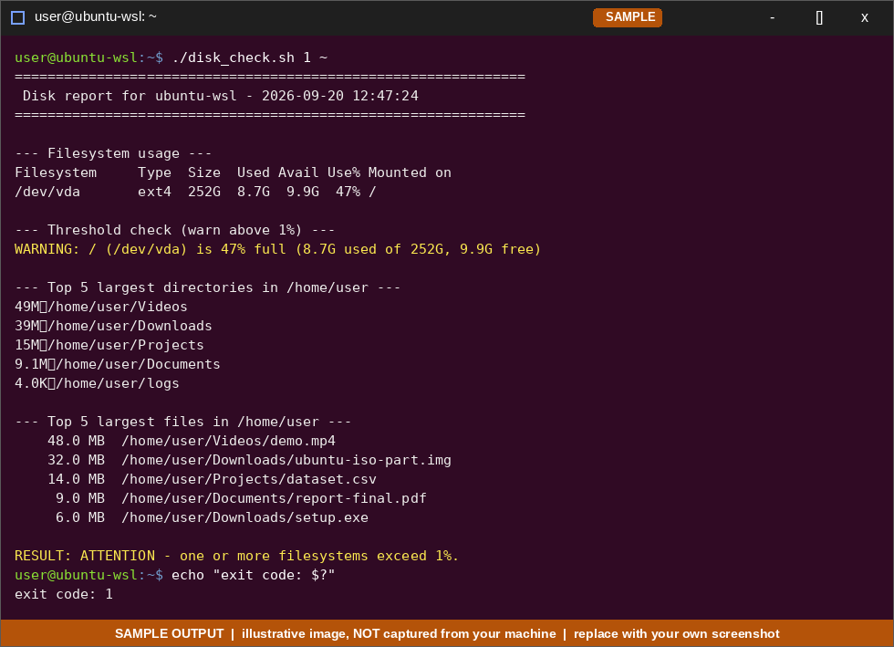
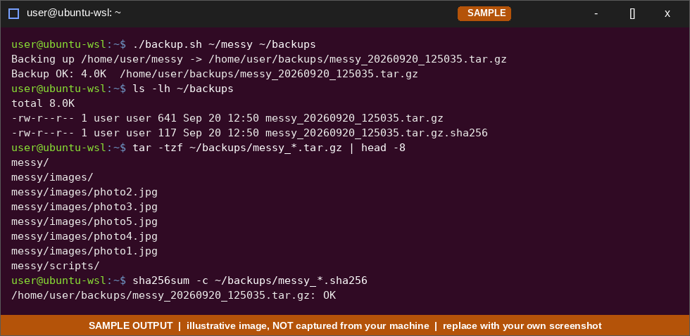
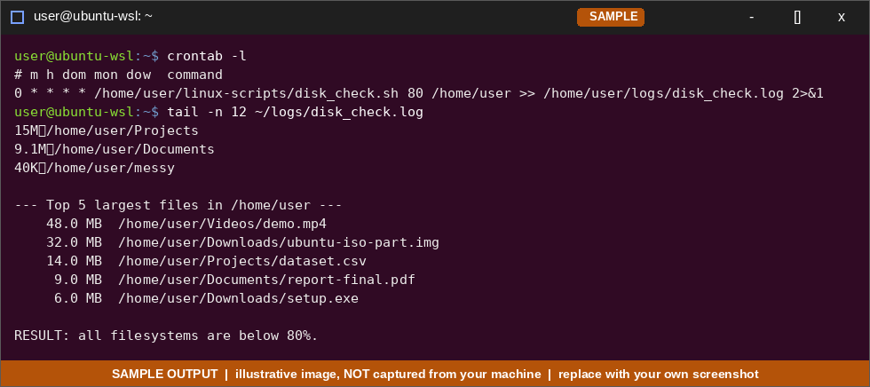
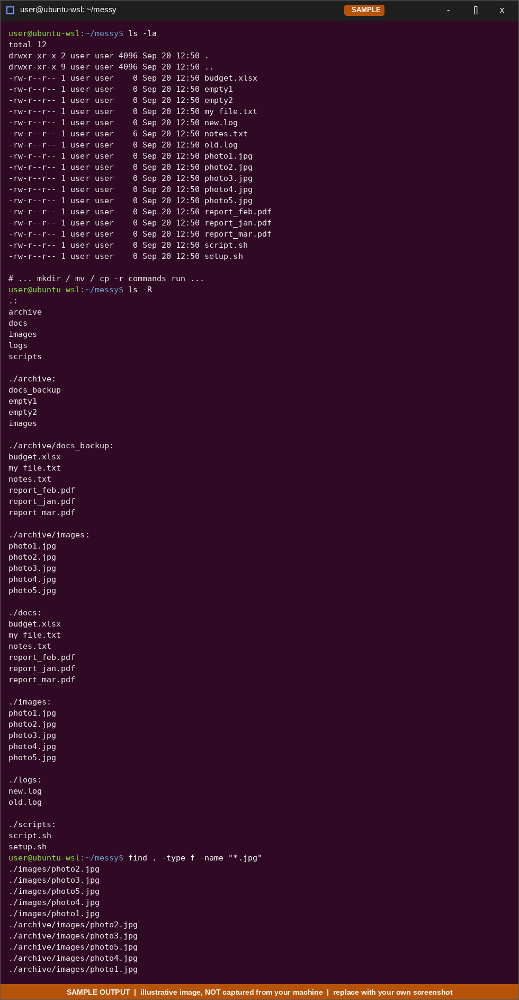
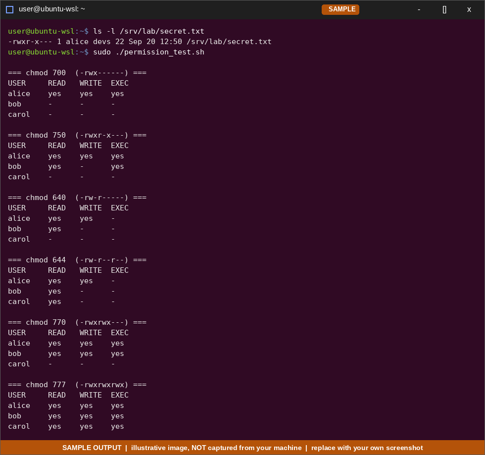
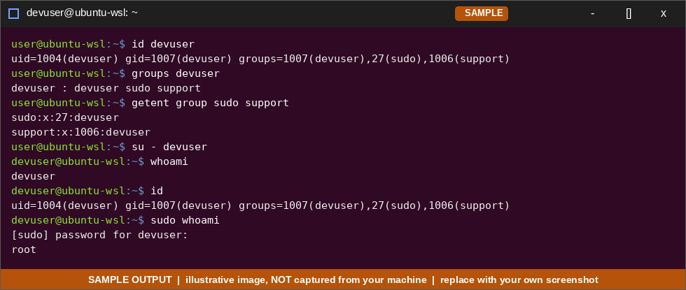
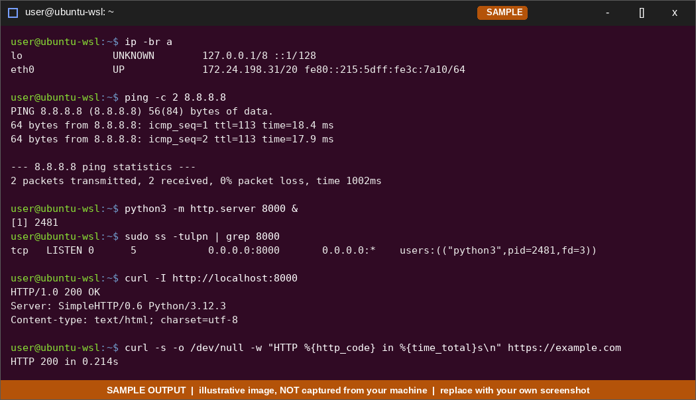
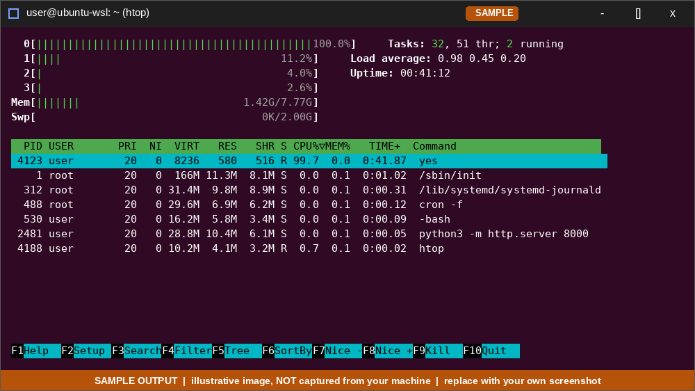

# 🐧 Linux Scripts

Covers **Part 4: Linux Health Check (WSL)**.

← [Back to main README](../README.md)

## Contents
- [Part 4: Linux Health Check (WSL)](#part-4-linux-health-check-wsl)
  - [4.0 WSL setup](#40-wsl-setup)
  - [4.1 Disk usage check script](#41-disk-usage-check-script)
  - [4.2 Backup script](#42-backup-script)
  - [4.3 Hourly cron job](#43-hourly-cron-job)
  - [4.4 Files & directories practice](#44-files--directories-practice)
  - [4.5 Permissions in depth](#45-permissions-in-depth)
  - [4.6 User administration](#46-user-administration)
  - [4.7 Networking commands](#47-networking-commands)
  - [4.8 htop](#48-htop)

---

# Part 4: Linux Health Check (WSL)

## 4.0 WSL setup

From an **elevated PowerShell** on Windows:

```powershell
wsl --install -d Ubuntu          # installs WSL2 + Ubuntu (reboot if asked)
wsl -l -v                        # confirm distro + VERSION 2
```

Inside Ubuntu:

```bash
sudo apt update && sudo apt upgrade -y
mkdir -p ~/linux-scripts ~/logs ~/backups
cd ~/linux-scripts
```

**Saving the scripts from this README:** create the file, paste the code, make it executable.

```bash
nano ~/linux-scripts/disk_check.sh      # paste, Ctrl+O, Enter, Ctrl+X
chmod +x ~/linux-scripts/disk_check.sh
```

> If a script fails with `bad interpreter: /usr/bin/env: 'bash\r'`, the file has Windows (CRLF) line endings. Fix with `sed -i 's/\r$//' script.sh` (or `dos2unix`).

---

## 4.1 Disk usage check script

**Requirements:** report disk usage, list the top 5 largest files/folders, flag any filesystem more than 80% full.

### `disk_check.sh`

```bash
#!/usr/bin/env bash
# disk_check.sh - disk usage report, top-5 largest dirs/files, >THRESHOLD% warning
# Usage: ./disk_check.sh [threshold_percent=80] [directory_to_scan=$HOME]
# Exit code: 0 = all OK, 1 = at least one filesystem over threshold

set -uo pipefail

THRESHOLD="${1:-80}"
TARGET="${2:-$HOME}"
ALERT=0

echo "=============================================================="
echo " Disk report for $(hostname) - $(date '+%Y-%m-%d %H:%M:%S')"
echo "=============================================================="

echo
echo "--- Filesystem usage ---"
df -hT -x tmpfs -x devtmpfs -x squashfs

echo
echo "--- Threshold check (warn above ${THRESHOLD}%) ---"
# -P = POSIX format: one line per filesystem, predictable columns
while read -r fs size used avail pct mount; do
    usage="${pct%\%}"
    if [[ "$usage" =~ ^[0-9]+$ ]] && (( usage > THRESHOLD )); then
        echo "WARNING: ${mount} (${fs}) is ${usage}% full (${used} used of ${size}, ${avail} free)"
        ALERT=1
    else
        echo "OK:      ${mount} is ${usage}% full"
    fi
done < <(df -hP -x tmpfs -x devtmpfs -x squashfs | tail -n +2)

echo
echo "--- Top 5 largest directories in ${TARGET} ---"
# first line of sorted output is the total for TARGET itself, so skip it
du -h --max-depth=1 "$TARGET" 2>/dev/null | sort -rh | sed -n '2,6p'

echo
echo "--- Top 5 largest files in ${TARGET} ---"
find "$TARGET" -xdev -type f -printf '%s\t%p\n' 2>/dev/null \
    | sort -nr | head -n 5 \
    | awk -F'\t' '{ printf "%8.1f MB  %s\n", $1/1048576, $2 }'

echo
if (( ALERT )); then
    echo "RESULT: ATTENTION - one or more filesystems exceed ${THRESHOLD}%."
else
    echo "RESULT: all filesystems are below ${THRESHOLD}%."
fi
exit "$ALERT"
```

### Run & test

```bash
./disk_check.sh                 # defaults: 80%, $HOME
./disk_check.sh 80 /var         # scan /var
./disk_check.sh 1 ~             # threshold of 1% forces WARNING lines, so you can prove the flag works
echo "exit code: $?"
```

**How it works**

| Piece | Purpose |
|-------|---------|
| `df -hT` | Human-readable usage + filesystem type |
| `df -hP … \| while read` | Parses each filesystem's `Use%` and compares with the threshold |
| `du -h --max-depth=1 \| sort -rh` | Largest sub-directories first |
| `find -printf '%s\t%p' \| sort -nr` | Sorts files by byte size (safe for names with spaces) |
| `exit "$ALERT"` | Non-zero exit lets cron/monitoring detect problems |

> **WSL note:** Windows drives appear as `/mnt/c`, `/mnt/d` (type `9p` / `drvfs`) and are included in the check. The Linux root (`/`) is a virtual disk file, and its "size" is bounded by the Windows drive that holds it.

📸 

---

## 4.2 Backup script

**Requirement:** create a `.tar.gz` archive with a timestamp in its name.

### `backup.sh`

```bash
#!/usr/bin/env bash
# backup.sh - timestamped .tar.gz backup of a directory
# Usage: ./backup.sh <source_dir> [destination_dir=$HOME/backups] [keep_days=14]

set -euo pipefail

SRC="${1:?Usage: $0 <source_dir> [destination_dir] [keep_days]}"
DEST="${2:-$HOME/backups}"
KEEP_DAYS="${3:-14}"

[[ -d "$SRC" ]] || { echo "ERROR: '$SRC' is not a directory" >&2; exit 1; }

SRC_ABS="$(realpath "$SRC")"
NAME="$(basename "$SRC_ABS")"
STAMP="$(date +%Y%m%d_%H%M%S)"
ARCHIVE="${DEST}/${NAME}_${STAMP}.tar.gz"

mkdir -p "$DEST"

echo "Backing up ${SRC_ABS} -> ${ARCHIVE}"
tar -czf "$ARCHIVE" -C "$(dirname "$SRC_ABS")" "$NAME"

# integrity checks: archive can be read + record a checksum
tar -tzf "$ARCHIVE" > /dev/null
sha256sum "$ARCHIVE" > "${ARCHIVE}.sha256"

echo "Backup OK: $(du -h "$ARCHIVE" | cut -f1)  $ARCHIVE"

# retention: remove backups of this folder older than KEEP_DAYS days
find "$DEST" -maxdepth 1 -name "${NAME}_*.tar.gz*" -mtime +"$KEEP_DAYS" -print -delete
```

### Run & verify

```bash
./backup.sh ~/messy ~/backups
ls -lh ~/backups
tar -tzf ~/backups/messy_*.tar.gz | head          # list contents without extracting
sha256sum -c ~/backups/messy_*.sha256              # verify checksum

# restore test: extract into a temp folder
mkdir -p /tmp/restore-test && tar -xzf ~/backups/messy_*.tar.gz -C /tmp/restore-test
ls -la /tmp/restore-test
```

| Flag | Meaning |
|------|---------|
| `-c` | create archive |
| `-z` | gzip-compress |
| `-f` | file name follows |
| `-t` | list contents (test) |
| `-x` | extract |
| `-C dir` | change to `dir` first, so the archive holds relative paths |

📸 

---

## 4.3 Hourly cron job

**Step 1: install and start cron** (WSL doesn't always start it automatically):

```bash
sudo apt install -y cron
sudo service cron start                 # WSL without systemd
# If systemd is enabled in WSL (/etc/wsl.conf → [boot] systemd=true):
# sudo systemctl enable --now cron
sudo service cron status
```

**Step 2: add the job** with `crontab -e`:

```cron
# m h dom mon dow  command
0 * * * * /home/<your-user>/linux-scripts/disk_check.sh 80 /home/<your-user> >> /home/<your-user>/logs/disk_check.log 2>&1
```

Cron uses a minimal environment and **does not expand `~`**, so use absolute paths (`echo $HOME` shows yours).

**Cron field reference**

| Field | Range | Example |
|-------|-------|---------|
| minute | 0–59 | `0` |
| hour | 0–23 | `*` (every hour) |
| day of month | 1–31 | `*` |
| month | 1–12 | `*` |
| day of week | 0–7 (0/7 = Sun) | `*` |

**Step 3: verify**

```bash
crontab -l                                   # job is installed
tail -f ~/logs/disk_check.log                # watch output appear
grep CRON /var/log/syslog | tail             # execution log (if rsyslog is installed)
```
For a quick test, temporarily change the schedule to `* * * * *` (every minute), confirm the log grows, then restore `0 * * * *`.

> **Important WSL limitation:** WSL shuts its VM down when idle, so cron only fires while the distro is running. For a truly hourly job on a Windows machine, use **Windows Task Scheduler** to run `wsl.exe -d Ubuntu -e /home/<user>/linux-scripts/disk_check.sh`, or keep a WSL session open.

📸 

---

## 4.4 Files & directories practice

### Build the messy test folder

```bash
mkdir -p ~/messy && cd ~/messy
touch report_{jan,feb,mar}.pdf photo{1..5}.jpg notes.txt budget.xlsx "my file.txt" \
      script.sh old.log new.log setup.sh empty1 empty2
echo "hello" > notes.txt
ls -la
```

### Organise it

```bash
mkdir -p docs images logs scripts archive

mv -v report_*.pdf budget.xlsx notes.txt "my file.txt" docs/    # quotes for names with spaces
mv -v *.jpg images/
mv -v *.log logs/
mv -v *.sh scripts/

cp -r docs archive/docs_backup           # recursive copy (folders need -r)
cp -rv images archive/                   # -v shows what was copied
mv empty1 empty2 archive/                # move
mv archive/empty1 archive/empty_renamed  # mv also renames

ls -laR                                  # recursive detailed listing
```

### `find` combos

```bash
find . -type f -name "*.jpg"                     # by name
find . -type f -iname "*.PDF"                    # case-insensitive
find . -type f -empty                            # empty files
find . -type f -mtime -1                         # modified in last 24h
find . -type f -size +1M                         # larger than 1 MB
find . -type d -empty                            # empty folders
find . -name "*.log" -exec ls -lh {} \;          # run a command on each match
find . -name "*.sh" -exec chmod +x {} +          # make all scripts executable
find . -type f -name "*.txt" -exec cp -v {} archive/ \;   # copy matches
```

### Bulk-organise by extension (one loop)

```bash
# --- demo: sort every file in a folder into subfolders named after its extension
mkdir -p ~/messy2 && cd ~/messy2 && touch a.txt b.txt c.jpg d.log e.pdf
for f in *.*; do
    ext="${f##*.}"
    mkdir -p "by_ext/$ext"
    mv -n -- "$f" "by_ext/$ext/"          # -n = never overwrite
done
ls -R by_ext
```

### `ls` combinations to know

| Command | Shows |
|---------|-------|
| `ls -la` | All files (incl. hidden) with permissions, owner, size |
| `ls -lah` | Same, human-readable sizes |
| `ls -lat` | Sorted by modification time, newest first |
| `ls -laS` | Sorted by size, largest first |
| `ls -ld dir/` | The directory's own permissions (not contents) |
| `ls -laR` | Recursive |

📸 

---

## 4.5 Permissions in depth

### Concepts

```
-rwxr-x---  1 alice devs  13 Jan 10 09:00 secret.txt
│└┬┘└┬┘└┬┘
│ │  │  └── others: no access
│ │  └───── group : r-x  (5)
│ └──────── owner : rwx  (7)
└────────── file type (- file, d directory, l link)
```

| Bit | Value | On a **file** | On a **directory** |
|-----|-------|---------------|--------------------|
| `r` | 4 | read contents | list names |
| `w` | 2 | modify contents | create/delete/rename entries inside |
| `x` | 1 | execute as program | enter (`cd`) and access items inside |

`chmod 750` = owner `7` (4+2+1 = rwx), group `5` (4+1 = r-x), others `0` (---).

### Setup: three users and a shared file

```bash
# users: alice = owner, bob = in group "devs", carol = "others"
for u in alice bob carol; do sudo adduser --disabled-password --gecos "" "$u"; done
sudo groupadd devs
sudo usermod -aG devs alice
sudo usermod -aG devs bob

# folder everyone can traverse, file owned by alice:devs
sudo mkdir -p /srv/lab && sudo chmod 755 /srv/lab
echo "confidential lab data" | sudo tee /srv/lab/secret.txt > /dev/null
sudo chown alice:devs /srv/lab/secret.txt

# the level being tested
sudo chmod 750 /srv/lab/secret.txt
ls -l /srv/lab/secret.txt
stat -c '%a %A %U:%G %n' /srv/lab/secret.txt
```

### Manual tests: switch users

```bash
sudo -u bob   cat /srv/lab/secret.txt                       # group can read    → works
sudo -u bob   bash -c 'echo x >> /srv/lab/secret.txt'       # group cannot write → Permission denied
sudo -u carol cat /srv/lab/secret.txt                       # others: no access  → Permission denied
sudo -u alice bash -c 'echo owner-edit >> /srv/lab/secret.txt' && echo "owner can write"

# fully interactive alternative
sudo -iu bob        # then: id ; cat /srv/lab/secret.txt ; exit
```

### Automated matrix: `permission_test.sh`

```bash
#!/usr/bin/env bash
# permission_test.sh - show what owner / group member / other can do at each mode
# Usage: sudo ./permission_test.sh   (needs users alice, bob, carol and /srv/lab/secret.txt)

FILE=/srv/lab/secret.txt
MODES=(700 750 640 644 770 777)

for mode in "${MODES[@]}"; do
    chmod "$mode" "$FILE"
    printf '\n=== chmod %s  (%s) ===\n' "$mode" "$(stat -c %A "$FILE")"
    printf '%-8s %-6s %-6s %-6s\n' USER READ WRITE EXEC
    for u in alice bob carol; do
        r='-'; w='-'; x='-'
        sudo -u "$u" test -r "$FILE" && r='yes'
        sudo -u "$u" test -w "$FILE" && w='yes'
        sudo -u "$u" test -x "$FILE" && x='yes'
        printf '%-8s %-6s %-6s %-6s\n' "$u" "$r" "$w" "$x"
    done
done
chmod 750 "$FILE"      # leave in the required state
```

### Expected results

| Mode | Symbolic | alice (owner) | bob (group) | carol (other) |
|------|----------|---------------|-------------|---------------|
| 700 | `rwx------` | R W X | none | none |
| **750** | `rwxr-x---` | R W X | R – X | none |
| 640 | `rw-r-----` | R W – | R – – | none |
| 644 | `rw-r--r--` | R W – | R – – | R – – |
| 770 | `rwxrwx---` | R W X | R W X | none |
| 777 | `rwxrwxrwx` | R W X | R W X | R W X (**never use in production**) |

(Record your observed output next to this table and attach the screenshot.)

### Useful extras

```bash
chmod u=rwx,g=rx,o= file        # symbolic form of 750
chmod g+w file                  # add write for group
chmod o-rwx file                # remove all access for others
chmod -R 750 dir/               # recursive
sudo chown alice:devs file      # change owner and group
sudo chgrp devs file            # change group only
umask                           # default permission mask (0022 → new files 644, dirs 755)
chmod g+s /srv/lab              # setgid dir: new files inherit the directory's group
chmod +t /srv/shared            # sticky bit: only file owner may delete their files (like /tmp)
```

📸 

---

## 4.6 User administration

Create a user, add to a group, grant sudo, and verify with `whoami` / `id`.

```bash
# 1. create the user (prompts for password and details)
sudo adduser devuser

# 2. create a group and add the user (-a = APPEND; without it, other groups are removed!)
sudo groupadd support
sudo usermod -aG support devuser

# 3. grant sudo (Ubuntu/Debian: members of the "sudo" group)
sudo usermod -aG sudo devuser

# 4. verify
id devuser                       # uid, gid and all groups
groups devuser
getent group sudo support        # members of each group
sudo -l -U devuser               # what sudo allows

# 5. test as that user
su - devuser
whoami                           # → devuser
id                               # groups include sudo, support
sudo whoami                      # → root   (prompts for devuser's password)
exit
```

**Least-privilege alternative:** allow only specific commands via a drop-in file. Always edit with `visudo` (it syntax-checks):

```bash
sudo visudo -f /etc/sudoers.d/devuser
# add a line such as:
# devuser ALL=(ALL) /usr/bin/apt, /usr/bin/systemctl status *
```

**Cleanup:**
```bash
sudo deluser --remove-home devuser
sudo gpasswd -d devuser sudo     # remove from a group only
```

| Command | Purpose |
|---------|---------|
| `adduser` / `useradd` | Create user (`adduser` is the friendly Debian/Ubuntu wrapper) |
| `usermod -aG grp user` | Add user to a supplementary group |
| `passwd user` | Set/change password |
| `id`, `groups`, `whoami` | Identity checks |
| `sudo -l` | List your sudo rights |
| `visudo` | Safely edit sudoers |

📸 

---

## 4.7 Networking commands

```bash
ip a                              # interfaces & IP addresses (short: ip -br a)
ip r                              # routing table / default gateway
hostname -I                       # quick IP list
cat /etc/resolv.conf              # DNS servers in use

ping -c 4 8.8.8.8                 # connectivity by IP (no DNS needed)
ping -c 4 google.com              # tests DNS + connectivity

ss -tulpn                         # listening sockets with owning process
sudo ss -tulpn                    # sudo needed to show other users' processes

curl -I https://example.com       # headers only: proves HTTP(S) works
curl -s -o /dev/null -w "HTTP %{http_code} in %{time_total}s\n" https://example.com
curl -v http://localhost:8000     # verbose: see the connection steps
```

**Diagnosis ladder**

| If this fails… | …the problem is probably |
|----------------|--------------------------|
| `ping 127.0.0.1` | Local network stack |
| `ping <gateway from ip r>` | Local link / virtual switch |
| `ping 8.8.8.8` | Routing / internet access |
| `ping google.com` (but 8.8.8.8 works) | **DNS** |
| `curl https://…` (but ping works) | Proxy, firewall, TLS or the site itself |

**`ss -tulpn` flags:** `-t` TCP · `-u` UDP · `-l` listening only · `-p` show process · `-n` numeric (no name lookup).

**Prove a port opens and closes:**
```bash
python3 -m http.server 8000 &          # start a test web server in the background
ss -tulpn | grep 8000                  # LISTEN on 0.0.0.0:8000
curl -I http://localhost:8000          # HTTP/1.0 200 OK
kill %1                                # stop it
ss -tulpn | grep 8000                  # nothing → port closed
```

> **WSL2 note:** WSL2 sits behind a virtual NAT, so `ip a` shows a different address from the Windows host. Windows can reach WSL services on `localhost` in most setups.

📸 

---

## 4.8 Install and use `htop`

```bash
sudo apt update
sudo apt install -y htop
htop
```

**Generate load to watch:**
```bash
yes > /dev/null &        # burns one CPU core
htop                     # find "yes" at the top of the list
kill %1                  # or kill it from inside htop with F9
```

| Key | Action |
|-----|--------|
| `F1` | Help |
| `F2` | Setup (columns, meters, colours) |
| `F3` or `/` | Search process |
| `F4` or `\` | Filter |
| `F5` | Tree view (parent/child) |
| `F6` | Sort by column (CPU%, MEM%, TIME) |
| `F9` | Kill (choose signal, `15` polite, `9` force) |
| `F10` or `q` | Quit |
| `htop -u <user>` | Show only one user's processes |

**How to read it:** the coloured bars at the top show per-core CPU and RAM/Swap; **Load average** (1/5/15 min) higher than the number of cores means the machine is overloaded; sort by `MEM%` to find leaks.

📸 

---

← [Back to main README](../README.md) · Next: [networking-notes](../networking-notes/README.md)
