 
# 🌐 Networking Notes

Covers **Part 3 (Networking Setup, Windows)** and **Part 6 (Cloud-Based Productivity Tools)**.

← [Back to main README](../README.md)

## Contents
- [Lab topology](#lab-topology)
- [Part 3: Networking Setup](#part-3-networking-setup)
  - [3.1 Static IP, gateway, DNS](#31-static-ip-gateway-dns)
  - [3.2 Firewall: block a port and prove it](#32-firewall-block-a-port-and-prove-it)
  - [3.3 Network discovery](#33-network-discovery)
  - [3.4 Share a folder](#34-share-a-folder)
  - [3.5 Map a drive and a network printer](#35-map-a-drive-and-a-network-printer)
  - [3.6 RDP vs SSH vs remote-support apps](#36-rdp-vs-ssh-vs-remote-support-apps)
  - [3.7 Workgroup vs Domain](#37-workgroup-vs-domain)
- [Part 6: Cloud-Based Productivity Tools](#part-6-cloud-based-productivity-tools)

---

## Lab topology

```
        ┌────────────────────────── 192.168.1.0/24 ──────────────────────────┐
        │                                                                      │
   ┌────┴─────┐            ┌───────────────┐            ┌───────────────┐
   │ Gateway  │            │   IT-WS01     │            │   IT-WS02     │
   │ .1  (DNS)│            │ Win 11 Pro    │◄──────────►│ Win 10/11 Pro │
   └──────────┘            │ 192.168.1.50  │  tests     │ 192.168.1.60  │
                           │ share, RDP,   │            │ client / RDP  │
                           │ firewall rule │            │ source        │
                           └───────────────┘            └───────────────┘
```

Replace the addresses with your lab's subnet. Choose static IPs **outside the DHCP pool** to avoid conflicts. Open an **elevated PowerShell** on each VM.

---

# Part 3: Networking Setup

## 3.1 Static IP, gateway, DNS

**Identify the adapter and current settings:**
```powershell
Get-NetAdapter
Get-NetIPConfiguration
```

**Configure (PowerShell):**
```powershell
$if = "Ethernet"      # InterfaceAlias from Get-NetAdapter

# stop using DHCP on this interface
Set-NetIPInterface -InterfaceAlias $if -Dhcp Disabled

# clear any old address / default route that would conflict
Remove-NetIPAddress -InterfaceAlias $if -AddressFamily IPv4 -Confirm:$false -ErrorAction SilentlyContinue
Remove-NetRoute     -InterfaceAlias $if -AddressFamily IPv4 -Confirm:$false -ErrorAction SilentlyContinue

# static IP + prefix (/24 = 255.255.255.0) + default gateway
New-NetIPAddress -InterfaceAlias $if -IPAddress 192.168.1.50 -PrefixLength 24 -DefaultGateway 192.168.1.1

# DNS servers: primary then secondary
Set-DnsClientServerAddress -InterfaceAlias $if -ServerAddresses 192.168.1.1, 8.8.8.8
```

**Equivalent with `netsh`:**
```cmd
netsh interface ip set address name="Ethernet" static 192.168.1.50 255.255.255.0 192.168.1.1
netsh interface ip set dns name="Ethernet" static 192.168.1.1
netsh interface ip add dns name="Ethernet" 8.8.8.8 index=2
```

**Verify:**
```powershell
ipconfig /all
Get-NetIPConfiguration -InterfaceAlias "Ethernet"
ping 192.168.1.1                          # gateway reachable?
ping 8.8.8.8                              # internet routing OK?
nslookup google.com                       # DNS OK?
Resolve-DnsName google.com
```

**Revert to DHCP:**
```powershell
Remove-NetRoute -InterfaceAlias "Ethernet" -DestinationPrefix "0.0.0.0/0" -Confirm:$false -ErrorAction SilentlyContinue
Set-NetIPInterface -InterfaceAlias "Ethernet" -Dhcp Enabled
Set-DnsClientServerAddress -InterfaceAlias "Ethernet" -ResetServerAddresses
# or: netsh interface ip set address name="Ethernet" dhcp ; netsh interface ip set dns name="Ethernet" dhcp
```

**Troubleshooting ladder:** gateway ping fails → wrong subnet/VM network mode. Internet ping works but names don't resolve → DNS. `169.254.x.x` address → DHCP failed (APIPA).

📸 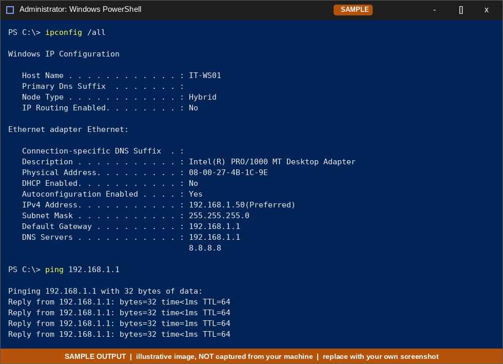

---

## 3.2 Firewall: block a port and prove it

**Goal:** show that a listener on TCP **8080** is reachable, then blocked by a Windows Firewall rule, and confirm using `Test-NetConnection` (and `telnet`).

**Step 1: start a test listener on `IT-WS01`:**
```powershell
$listener = [System.Net.Sockets.TcpListener]::new([System.Net.IPAddress]::Any, 8080)
$listener.Start()
"Listening on TCP 8080 - leave this window open"
# when finished:  $listener.Stop()
```

**Step 2: allow the port and confirm it works (from `IT-WS02`):**
```powershell
# on IT-WS01
New-NetFirewallRule -DisplayName "Allow Inbound TCP 8080 (test)" -Direction Inbound -Protocol TCP -LocalPort 8080 -Action Allow -Profile Any

# on IT-WS02
Test-NetConnection -ComputerName 192.168.1.50 -Port 8080
# expected: TcpTestSucceeded : True
```

**Step 3: add the block rule (on `IT-WS01`):**
```powershell
New-NetFirewallRule -DisplayName "Block Inbound TCP 8080" -Direction Inbound -Protocol TCP -LocalPort 8080 -Action Block -Profile Any
```
> In Windows Firewall, **Block rules override Allow rules**, so the port is blocked even though the allow rule still exists.

**Step 4: test again (from `IT-WS02`):**
```powershell
Test-NetConnection -ComputerName 192.168.1.50 -Port 8080
# expected: WARNING: TCP connect to (192.168.1.50 : 8080) failed
#           TcpTestSucceeded : False
```

**Optional: `telnet` test** (client is not installed by default):
```powershell
Enable-WindowsOptionalFeature -Online -FeatureName TelnetClient -NoRestart
telnet 192.168.1.50 8080          # blank screen = connected, "Could not open connection" = blocked
```

**Verify the rule and clean up:**
```powershell
Get-NetFirewallRule -DisplayName "Block Inbound TCP 8080" | Format-List DisplayName, Enabled, Direction, Action
Get-NetFirewallRule -DisplayName "Block Inbound TCP 8080" | Get-NetFirewallPortFilter

Disable-NetFirewallRule -DisplayName "Block Inbound TCP 8080"     # test → succeeds again
Remove-NetFirewallRule  -DisplayName "Block Inbound TCP 8080"
Remove-NetFirewallRule  -DisplayName "Allow Inbound TCP 8080 (test)"
```

**`netsh` equivalent:**
```cmd
netsh advfirewall firewall add rule name="Block 8080" dir=in action=block protocol=TCP localport=8080
netsh advfirewall firewall delete rule name="Block 8080"
```

| Result | Meaning |
|--------|---------|
| `TcpTestSucceeded : True` | Port is open and something is listening |
| `False` with allow rule, no listener | Nothing is listening (not a firewall problem) |
| `False` with a listener running | Firewall (host, network or VM switch) is blocking it |

**Outbound variant** (block a machine from *reaching* a port): `-Direction Outbound -RemotePort 8080`, then run `Test-NetConnection <target> -Port 8080` on the same machine.

📸 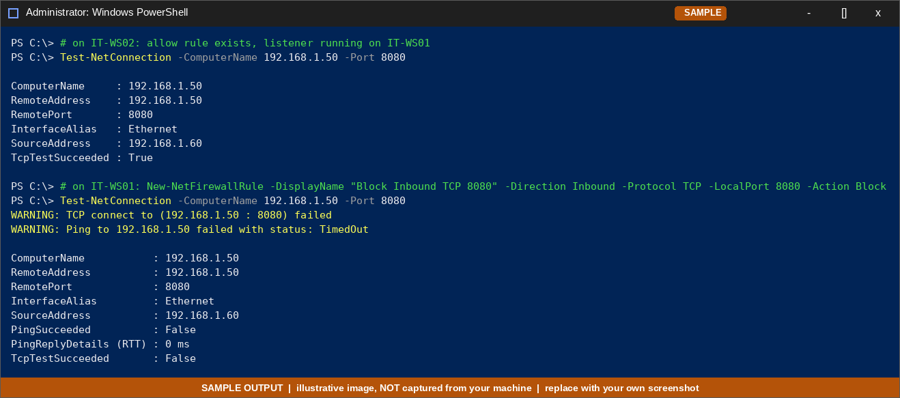

---

## 3.3 Network discovery

Network discovery controls whether the PC **appears in the Network view** of other devices (and whether it sees theirs). It requires the **Private** network profile.

**Enable (GUI):** *Control Panel → Network and Sharing Center → Change advanced sharing settings → Private → Turn on network discovery* (and *automatic setup*).

**Enable (PowerShell):**
```powershell
Set-NetConnectionProfile -InterfaceAlias "Ethernet" -NetworkCategory Private
Set-NetFirewallRule -DisplayGroup "Network Discovery" -Enabled True -Profile Private

# discovery depends on these services
Set-Service FDResPub -StartupType Automatic ; Start-Service FDResPub     # Function Discovery Resource Publication
Set-Service fdPHost  -StartupType Automatic ; Start-Service fdPHost      # Function Discovery Provider Host
Set-Service SSDPSRV  -StartupType Manual    ; Start-Service SSDPSRV
Set-Service upnphost -StartupType Manual    ; Start-Service upnphost
```

**Disable:**
```powershell
Set-NetFirewallRule -DisplayGroup "Network Discovery" -Enabled False
# or  netsh advfirewall firewall set rule group="Network Discovery" new enable=No
```

**Check state:**
```powershell
Get-NetFirewallRule -DisplayGroup "Network Discovery" | Select-Object DisplayName, Enabled, Profile | Format-Table -AutoSize
Get-NetConnectionProfile
```

**Confirm visibility from `IT-WS02`:**

| State on `IT-WS01` | File Explorer → *Network* on `IT-WS02` | `net view` on `IT-WS02` |
|--------------------|----------------------------------------|--------------------------|
| Discovery **ON** (Private) | `IT-WS01` is listed | `net view` lists `\\IT-WS01` |
| Discovery **OFF** | `IT-WS01` **not listed** | Not listed |

```cmd
net view
net view \\IT-WS01
```
(Allow a minute or two for the browse list to refresh.)

> **Key point:** discovery only controls **visibility**, not access. With discovery OFF the machine is still reachable by direct address, e.g. `\\192.168.1.50\TeamDocs` or `ping 192.168.1.50`, if shares/firewall rules allow it. Discovery is not a security control.

📸 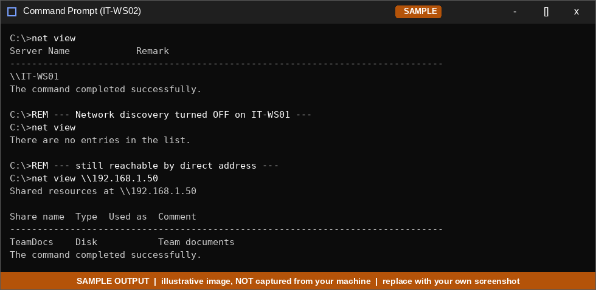

---

## 3.4 Share a folder

```powershell
# 1. folder + test file
New-Item C:\Shares\TeamDocs -ItemType Directory -Force | Out-Null
"hello from IT-WS01" | Set-Content C:\Shares\TeamDocs\welcome.txt

# 2. NTFS permissions (who may access the files)
icacls C:\Shares\TeamDocs /grant "jsmith:(OI)(CI)M"       # Modify

# 3. share permissions (who may connect over the network)
New-SmbShare -Name "TeamDocs" -Path "C:\Shares\TeamDocs" -FullAccess "Administrators" -ChangeAccess "jsmith" -Description "Team documents"

# 4. make sure file sharing is allowed through the firewall
Enable-NetFirewallRule -DisplayGroup "File and Printer Sharing"
```

CMD alternative: `net share TeamDocs=C:\Shares\TeamDocs /grant:jsmith,CHANGE`

**Verify on `IT-WS01`:**
```powershell
Get-SmbShare
Get-SmbShareAccess -Name TeamDocs
net share
```

**Access from `IT-WS02`:**
```powershell
Test-NetConnection 192.168.1.50 -Port 445           # SMB reachable?
net view \\192.168.1.50
dir \\192.168.1.50\TeamDocs                         # prompts for credentials: IT-WS01\jsmith
Get-Content \\192.168.1.50\TeamDocs\welcome.txt
"written from WS02" | Set-Content \\192.168.1.50\TeamDocs\from-ws02.txt   # Modify right → works
```
Or File Explorer address bar: `\\IT-WS01\TeamDocs`.

**Share permissions vs NTFS permissions:** both apply; the **most restrictive** wins. A common practice is to keep the share permission broad (e.g. *Change* for the group) and control fine detail with NTFS.

**Remove:** `Remove-SmbShare -Name TeamDocs -Force`

Troubleshooting: *"Network path not found"* → wrong IP/name, firewall, or SMB port 445 blocked. *"Access denied"* → wrong credentials or NTFS/share permission missing. *Repeated password prompts* → use `HOSTNAME\user` format.

📸 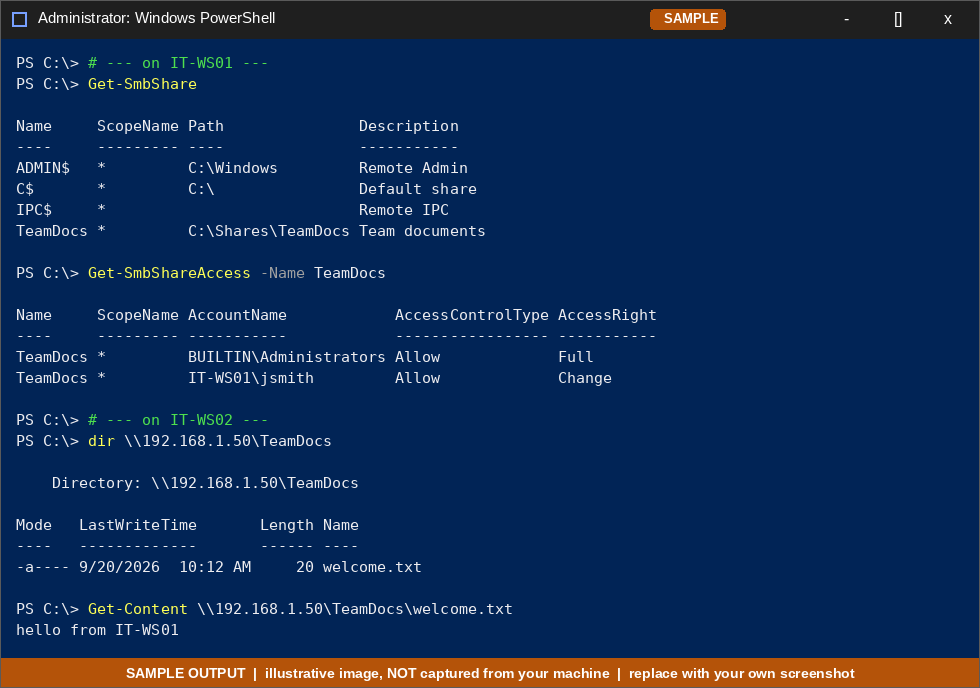

---

## 3.5 Map a drive and a network printer

### Map a share as a drive letter (`net use`)
```cmd
:: run on IT-WS02; '*' prompts for the password
net use Z: \\192.168.1.50\TeamDocs /user:IT-WS01\jsmith * /persistent:yes

net use                       :: list mapped drives and status
dir Z:\
net use Z: /delete            :: remove the mapping
```
PowerShell equivalent: `New-SmbMapping -LocalPath Z: -RemotePath \\192.168.1.50\TeamDocs` (or `New-PSDrive -Name Z -PSProvider FileSystem -Root \\192.168.1.50\TeamDocs -Persist`).

📸 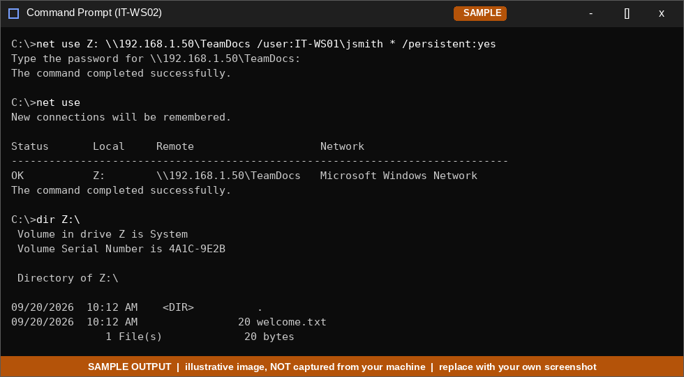

### Share a printer (on `IT-WS01`) and map it (on `IT-WS02`)

No physical printer is needed for a lab. Use the built-in virtual printer:

```powershell
# on IT-WS01: create/share a test printer
Get-Printer                                            # is "Microsoft Print to PDF" present?
Set-Printer -Name "Microsoft Print to PDF" -Shared $true -ShareName "LabPrinter"
# if sharing that printer is not allowed, create a text-only one instead:
# Add-Printer -Name "LabPrinter" -DriverName "Generic / Text Only" -PortName "FILE:" -Shared -ShareName "LabPrinter"
Get-Printer | Where-Object Shared | Format-Table Name, ShareName, DriverName

# make sure printer sharing is allowed through the firewall
Enable-NetFirewallRule -DisplayGroup "File and Printer Sharing"
```

```powershell
# on IT-WS02: connect to the shared printer
Add-Printer -ConnectionName "\\192.168.1.50\LabPrinter"
Get-Printer | Where-Object Name -like "*LabPrinter*"
"Test print from WS02" | Out-Printer -Name "\\192.168.1.50\LabPrinter"

# legacy CLI options
rundll32 printui.dll,PrintUIEntry /in /n"\\192.168.1.50\LabPrinter"
net use LPT1: \\192.168.1.50\LabPrinter /persistent:yes
```
GUI: *Settings → Bluetooth & devices → Printers & scanners → Add device → Add manually → "Select a shared printer by name"*.

**Verify:** the printer shows in `Get-Printer` on WS02, and a test job appears in the queue (`Get-PrintJob -PrinterName "\\192.168.1.50\LabPrinter"`) or produces the PDF prompt.

📸 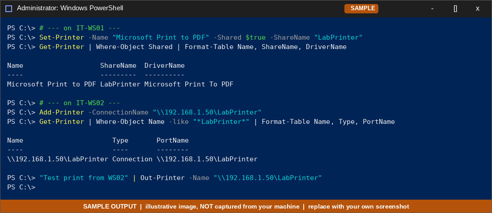

---

## 3.6 RDP vs SSH vs remote-support apps

### A. Remote Desktop (RDP) to `IT-WS02`

The *target* must run **Windows Pro/Enterprise/Education** (Home can connect out, but can't host).

```powershell
# on the target (IT-WS02), elevated
Set-ItemProperty 'HKLM:\System\CurrentControlSet\Control\Terminal Server' -Name fDenyTSConnections -Value 0
Enable-NetFirewallRule -DisplayGroup "Remote Desktop"

# require Network Level Authentication (recommended)
Set-ItemProperty 'HKLM:\System\CurrentControlSet\Control\Terminal Server\WinStations\RDP-Tcp' -Name UserAuthentication -Value 1

# allow a standard user (admins are allowed by default)
Add-LocalGroupMember -Group "Remote Desktop Users" -Member "jsmith"
```
GUI: *Settings → System → Remote Desktop → On*.

```powershell
# from the client (IT-WS01)
Test-NetConnection 192.168.1.60 -Port 3389
mstsc /v:192.168.1.60
# optional: save credentials
cmdkey /generic:TERMSRV/192.168.1.60 /user:IT-WS02\jsmith /pass:<password>
```
**Verify on the target:** `qwinsta` or `query user` shows the active RDP session.

📸 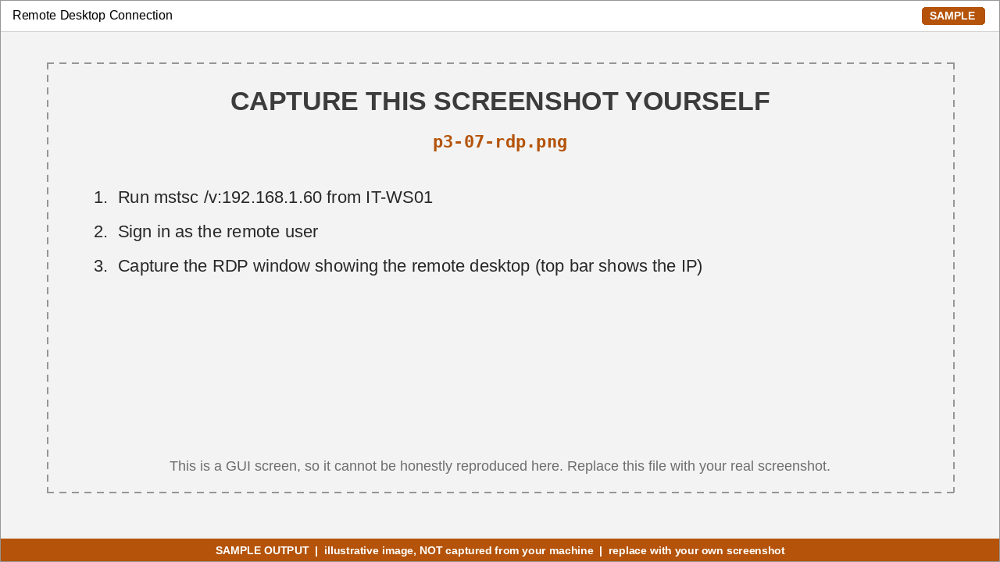

### B. SSH (OpenSSH) to the same machine

```powershell
# on the target: install + start the server
Add-WindowsCapability -Online -Name OpenSSH.Server~~~~0.0.1.0
Start-Service sshd
Set-Service -Name sshd -StartupType Automatic
Get-NetFirewallRule -Name *ssh* | Select-Object Name, Enabled       # OpenSSH-Server-In-TCP should be enabled

# from the client (built into Windows 10/11, WSL and Linux)
ssh jsmith@192.168.1.60
whoami ; hostname ; Get-Process | Select-Object -First 5        # commands run remotely
exit
```
Copy files: `scp .\notes.txt jsmith@192.168.1.60:C:/Users/jsmith/`.
Prefer **key-based** authentication: `ssh-keygen -t ed25519` then add the public key to `C:\ProgramData\ssh\administrators_authorized_keys` (admins) or `~\.ssh\authorized_keys` (standard users).

📸 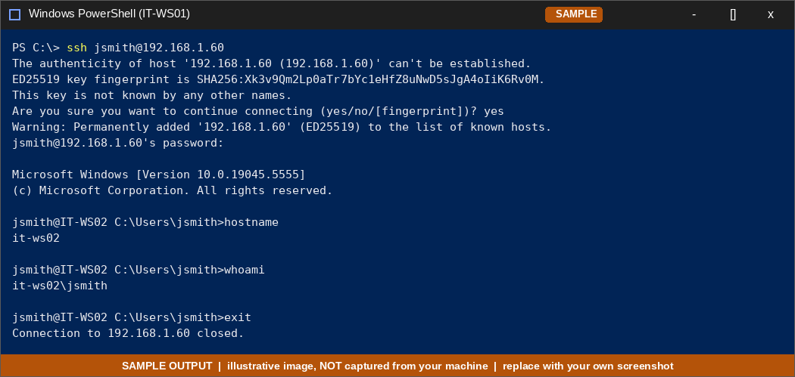

### C. Remote-support apps (TeamViewer / AnyDesk / Quick Assist)

Install the app on both machines, share the ID + one-time password (or invitation), and the end-user accepts the connection. No inbound firewall/NAT rules are needed: both sides connect *outbound* to the vendor's relay.

### Comparison

| | **RDP** | **SSH** | **TeamViewer / AnyDesk (remote support)** |
|---|---|---|---|
| Type | Full remote **desktop** (GUI) | Remote **command line** (also tunnels, file copy) | Remote GUI / screen-sharing + file transfer |
| Port / path | TCP **3389**, direct | TCP **22**, direct | Outbound to vendor relay (also direct P2P when possible) |
| Network requirement | Route to target; firewall/NAT rules needed for access across the internet (use VPN) | Same | Works through NAT/firewalls with no configuration |
| Session behavior | Opens its **own session**, and the local user of the same account is locked out | Text session, no visual impact on the user | **Shares the console screen**: the user watches and can co-operate |
| Best for | Admins managing servers/workstations on the LAN | Automation, scripting, servers, Linux, low bandwidth | Helping non-technical users, remote/unmanaged laptops |
| Authentication | Windows credentials (+NLA), can add MFA via gateway/VPN | Password or **keys**, can add MFA | Vendor account + ID/password; unattended access optional |
| Bandwidth | Medium–high | Very low | Medium |
| Cost | Included in Windows Pro+ | Free/open source | Free for personal use, paid for business |
| Security concerns | Never expose 3389 to the internet, so use NLA, VPN/RD Gateway, patching | Disable password login, use keys, restrict users | Third-party trust: enable 2FA, control unattended access, audit logs |
| Audit / management | Event logs, GPO | Logs, keys | Vendor console (business plans) |

**When to use which:** *SSH* for command-line administration and automation; *RDP* for full GUI work on machines you administer on the same network; *TeamViewer/AnyDesk/Quick Assist* for **attended support** where the user is present and there is no direct network path.

---

## 3.7 Workgroup vs Domain

The lab has no domain controller, so machines stay in a **workgroup**. The commands below show how to check and set it, and how a domain join *would* look.

```powershell
# where does this PC belong?
Get-CimInstance Win32_ComputerSystem | Select-Object Name, Domain, PartOfDomain, Workgroup

# rename the PC and put it in a workgroup (restart required)
Rename-Computer -NewName "IT-WS01"
Add-Computer -WorkgroupName "IT-LAB"
Restart-Computer
```
GUI: `sysdm.cpl` → *Computer Name* tab → **Change…** → *Workgroup*.

Domain join (documented only, **not executed**, because it needs a domain controller):
```powershell
Add-Computer -DomainName "corp.example.com" -Credential CORP\administrator -Restart
```

### Note: Workgroup vs Domain

| | **Workgroup** | **Domain (Active Directory)** |
|---|---|---|
| Design | Peer-to-peer; every PC is independent | Client/server; central directory on a **Domain Controller** |
| User accounts | **Local** on each PC (create the same user on every machine) | **One** account in AD works on any joined PC |
| Authentication | Local SAM database (NTLM) | Kerberos/NTLM against the domain controller |
| Management | Configure each PC individually | **Group Policy**, central software deployment, scripts |
| Security policy | Per machine, hard to enforce consistently | Enforced centrally (password rules, lockouts, restrictions) |
| Scale | Small (≈ up to 10–20 PCs) | Hundreds to thousands |
| Resource access | Share + local account per user | Share/NTFS permissions on AD users and groups (single sign-on) |
| Infrastructure / cost | None extra | Windows Server + DC (+ DNS), licensing, admin skills |
| Windows editions | All (incl. Home) | Pro / Enterprise / Education only (not Home) |
| Modern equivalent | n/a | **Microsoft Entra ID (Azure AD) join + Intune** for cloud-managed devices |

**In practice:** a home or a tiny office uses a workgroup; a company with dozens of staff needs a domain (or Entra ID + Intune) so onboarding a new employee is "create one account, log in anywhere" instead of creating local accounts on every PC.

📸 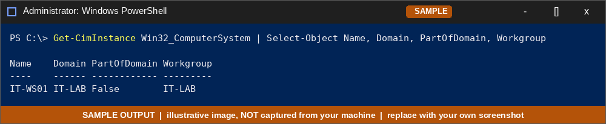

---

# Part 6: Cloud-Based Productivity Tools

**Tools used:** OneDrive (cloud storage & sync) + Microsoft 365 for the web *or* Google Drive + Google Docs. The steps are written for OneDrive; the Google Drive equivalent is in brackets. You need **two "locations"** to edit from: e.g. the synced folder on `IT-WS01` and the web browser (or a second PC).

## 6.1 Cloud folder sync + conflict resolution

**Set up sync**
1. Sign in to OneDrive on the PC (Windows 10/11 has the OneDrive client built in) [Google: install *Google Drive for desktop*].
2. Choose the folder(s) to sync (*OneDrive → Settings → Account → Choose folders*).
3. Create a test file in the synced folder and confirm the sync icon shows ✅ and the file appears on the web (onedrive.live.com or drive.google.com).

📸 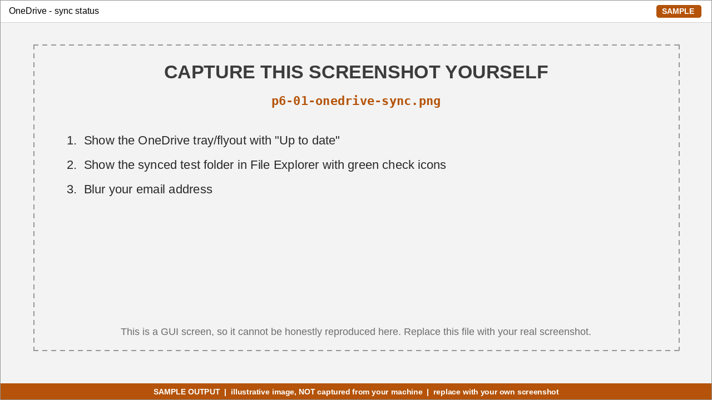

**Conflict test (edit the same file from two locations)**

| Step | Location | Action |
|------|----------|--------|
| 1 | PC | Create `conflict-test.txt` containing `original`. Wait for sync ✅ |
| 2 | PC | **Disconnect from the network** (disable the adapter or pause sync) |
| 3 | PC | Edit the file → append `edit from PC (offline)` and save |
| 4 | Web / 2nd device | While the PC is offline, edit the same file → append `edit from web` |
| 5 | PC | Reconnect / resume sync |
| 6 | PC + web | Observe the result and record it |

**What to look for** (record your observations):

| Item | Typical behavior (verify on your account) |
|------|-------------------------------------------|
| Plain files (`.txt`) | Sync engine keeps **both** versions and creates a *conflicted copy* named with the computer name (e.g. `conflict-test-IT-WS01.txt`) |
| Office documents (`.docx`, `.xlsx`) | With co-authoring, edits are **merged** automatically or you are prompted to *Keep both / Merge* |
| Version history | Right-click file on the web → *Version history* → view/restore an earlier version |
| Resolution | Open both files, merge manually, delete the extra copy |

Commands to help inspect: `dir "$env:OneDrive" /s` · `Get-ChildItem $env:OneDrive -Recurse -Filter "*conflict*"`.

**Lessons:** sync is **not backup**: deleting or corrupting a file syncs everywhere (recover from the Recycle Bin / version history); avoid two people editing the same non-Office file offline; save-often + co-authoring beats "last save wins".

📸 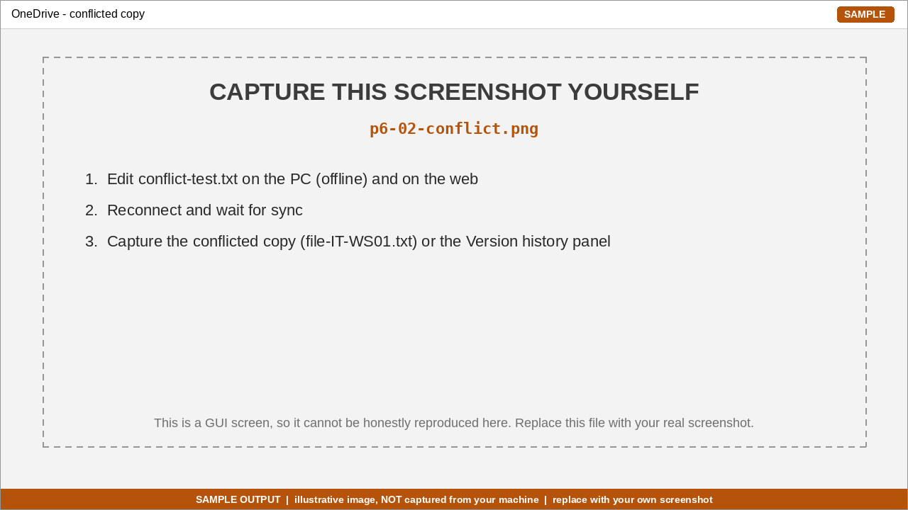

## 6.2 Sharing permissions: view-only vs edit

1. In OneDrive (web), right-click a test document → **Share** [Google Docs: **Share**].
2. Create **two links** (or invite two test accounts):
   - **Can view** (view-only) [Google: *Viewer*]
   - **Can edit** [Google: *Editor*]
3. Test each from a **private/incognito window or a second account**.

| Test | Expected result |
|------|-----------------|
| Open the *view-only* link | Document opens but the editing UI is absent/disabled; download may be allowed unless *Block download* is set |
| Try to type / edit as a viewer | Not possible ("view only") |
| Open the *edit* link | Full editing; changes appear in the owner's copy in real time |
| Revoke access (*Manage access → Stop sharing / remove link*) | The link stops working |

**Also try:** *Specific people* vs *Anyone with the link* · link **expiry date** · **password** on the link (where available) · Google's extra *Commenter* role.

**Best practice:** share with **specific people**, grant the **least privilege** (view unless they must edit), set expiry on external shares, and review *Manage access* regularly.

📸 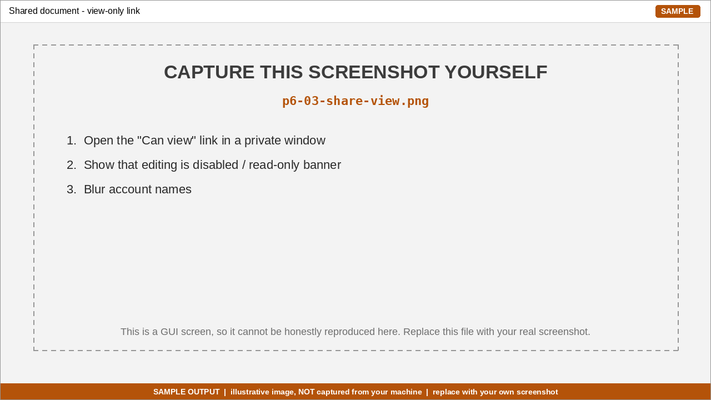
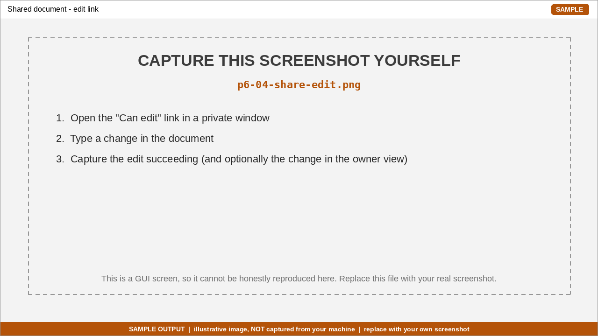

## 6.3 Two ways of using cloud computing: storage vs office suite

| | **Cloud storage** (OneDrive / Google Drive) | **Cloud office suite** (Microsoft 365 for the web / Google Docs) |
|---|---|---|
| What you get | Space to **keep and sync files** | A **complete application** running in the browser |
| Service model | **Storage-as-a-Service** (a storage-focused SaaS product) | **Software-as-a-Service (SaaS)** |
| Where the app runs | On **your PC** (Word/Excel installed locally); the cloud just holds the file | On the **provider's servers**; you only need a browser |
| What you manage | Your files, folders, sharing, local apps | Only your content and accounts |
| What the provider manages | Storage hardware, availability, sync service | Hardware, OS, the application, updates, scaling |
| Collaboration | Share files/folders; conflicts possible | **Real-time co-authoring**, comments, version history |
| Works offline | Yes (synced copy) | Limited (needs offline mode enabled) |
| Example task | Store a spreadsheet and sync it to 3 devices | Two people edit the same spreadsheet at once in the browser |

**Cloud service models at a glance**

| Model | You get | You manage | Example |
|-------|---------|------------|---------|
| **IaaS** | Virtual machines, storage, networks | OS, apps, data | Azure VM, AWS EC2 |
| **PaaS** | Runtime/platform to deploy code | App and data | Azure App Service, Google App Engine |
| **SaaS** | Finished application | Just your data/users | Microsoft 365, Google Workspace |
| **Storage-as-a-Service** | Scalable file/object storage | Files and permissions | OneDrive, Google Drive, Dropbox, S3 |

**Takeaway:** cloud *storage* moves **where your files live**; a cloud *office suite* moves **where the application runs**. Storage services are often delivered as SaaS, but the distinction matters: with storage you still bring your own software, with an office suite the software itself is the service.

📸 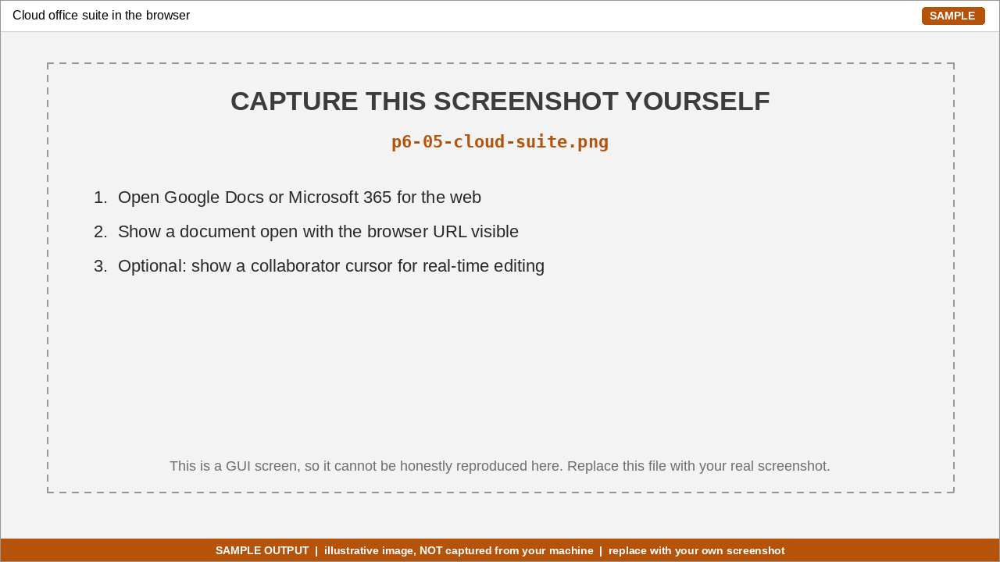

---

← [Back to main README](../README.md)
