# 🪟 Windows Scripts

Covers **Part 1 (System Diagnostic)**, **Part 2 (New Employee Onboarding)** and **Part 5 (Application Lifecycle)**.

← [Back to main README](../README.md)

## Contents
- [Conventions](#conventions)
- [Part 1: System Diagnostic Script](#part-1-system-diagnostic-script)
- [Part 2: New Employee Onboarding](#part-2-new-employee-onboarding)
- [Part 5: Application Lifecycle](#part-5-application-lifecycle)

## Conventions

- Run PowerShell **as Administrator** unless stated otherwise.
- Allow scripts for the current session only:
  ```powershell
  Set-ExecutionPolicy -Scope Process -ExecutionPolicy Bypass
  ```
- Test in a **VM with a snapshot**. Several steps change disks, policies and security settings.
- Screenshots live in `screenshots/` next to this file.

---

# Part 1: System Diagnostic Script

## 1.1 What the report captures

| Requirement | How it is captured |
|-------------|--------------------|
| OS version / build | `Win32_OperatingSystem` + `HKLM:\...\Windows NT\CurrentVersion` (build + UBR) |
| Edition / license | `EditionID`, `SoftwareLicensingProduct` (activation status), `slmgr /dli` |
| Disk space | `Win32_LogicalDisk` (size, free GB, free %) |
| File system per drive | `fsutil fsinfo volumeinfo <drive>\` + summary table |
| Boot method | `Get-ComputerInfo` (`BiosFirmwareType`), `bcdedit` loader path, Secure Boot, disk partition style |
| Installed apps | Uninstall registry keys (HKLM 64-bit, HKLM 32-bit, HKCU) |
| Network config | `Get-NetIPConfiguration`, `ipconfig /all`, adapters, ping test |
| Top 10 processes by memory | `Get-Process` sorted by working set |
| Hardware summary | CPU, cores, RAM, GPU: used later for the Part 5 requirements check |
| Health checks | `DISM /RestoreHealth`, `sfc /scannow`, `chkdsk /scan` with output captured |

> **Why the health checks run in this order:** Microsoft recommends `DISM /RestoreHealth` first (repairs the component store SFC pulls from), then `sfc /scannow`, then `chkdsk`.
> The `installed apps` list deliberately avoids `Win32_Product`, because querying it can trigger MSI repair/reconfiguration of installed software.

## 1.2 The script: `Get-SystemDiagnostic.ps1`

```powershell
<#
.SYNOPSIS
    IT Support Diagnostic Toolkit - Windows system report.
.DESCRIPTION
    Collects OS, license, disk, file system, boot mode, installed apps, network,
    top memory processes and hardware info, then runs DISM / SFC / CHKDSK.
    Everything is written to a timestamped text report.
.PARAMETER OutputDir
    Folder for the report (default: Desktop\Diagnostics).
.PARAMETER SkipRepairs
    Skip DISM / SFC / CHKDSK (they can take 20+ minutes).
.EXAMPLE
    .\Get-SystemDiagnostic.ps1
    .\Get-SystemDiagnostic.ps1 -SkipRepairs
#>
#Requires -RunAsAdministrator
[CmdletBinding()]
param(
    [string]$OutputDir = (Join-Path $env:USERPROFILE 'Desktop\Diagnostics'),
    [switch]$SkipRepairs
)

$ErrorActionPreference = 'Continue'
$stamp  = Get-Date -Format 'yyyyMMdd_HHmmss'
New-Item -ItemType Directory -Path $OutputDir -Force | Out-Null
$report = Join-Path $OutputDir "Diagnostic_${env:COMPUTERNAME}_$stamp.txt"

# ---------- helpers ----------
function Write-Section {
    param([string]$Title)
    $bar  = '=' * 72
    $text = "`n$bar`n  $Title`n$bar"
    Write-Host $text -ForegroundColor Cyan
    Add-Content -Path $report -Value $text -Encoding UTF8
}

function Write-Report {
    param([Parameter(ValueFromPipeline)]$InputObject)
    begin   { $buffer = @() }
    process { $buffer += $InputObject }
    end {
        $text = ($buffer | Out-String -Width 200).TrimEnd()
        Write-Host $text
        Add-Content -Path $report -Value $text -Encoding UTF8
    }
}

"IT SUPPORT DIAGNOSTIC REPORT"                     | Write-Report
"Computer : $env:COMPUTERNAME"                     | Write-Report
"User     : $env:USERDOMAIN\$env:USERNAME"         | Write-Report
"Generated: $(Get-Date -Format 'yyyy-MM-dd HH:mm:ss')" | Write-Report

# ---------- 1. Operating system ----------
Write-Section '1. OPERATING SYSTEM'
$os = Get-CimInstance Win32_OperatingSystem
$cv = Get-ItemProperty 'HKLM:\SOFTWARE\Microsoft\Windows NT\CurrentVersion'
[pscustomobject]@{
    Caption      = $os.Caption
    EditionID    = $cv.EditionID
    Version      = $cv.DisplayVersion
    Build        = "$($cv.CurrentBuild).$($cv.UBR)"
    Architecture = $os.OSArchitecture
    InstallDate  = $os.InstallDate
    LastBoot     = $os.LastBootUpTime
} | Format-List | Write-Report

# ---------- 2. Edition / license ----------
Write-Section '2. EDITION & LICENSE'
Get-CimInstance SoftwareLicensingProduct -Filter "PartialProductKey IS NOT NULL AND Name LIKE 'Windows%'" |
    Select-Object Name, Description,
        @{n='LicenseStatus';e={ switch ($_.LicenseStatus) {
            0 {'Unlicensed'} 1 {'Licensed (Activated)'} 2 {'Out-of-box grace'} 3 {'Out-of-tolerance grace'}
            4 {'Non-genuine grace'} 5 {'Notification'} 6 {'Extended grace'} default {'Unknown'} } }},
        PartialProductKey |
    Format-List | Write-Report
(cscript //nologo "$env:windir\System32\slmgr.vbs" /dli) | Write-Report

# ---------- 3. Hardware summary ----------
Write-Section '3. HARDWARE SUMMARY'
$cs  = Get-CimInstance Win32_ComputerSystem
$cpu = Get-CimInstance Win32_Processor | Select-Object -First 1
[pscustomobject]@{
    Manufacturer      = $cs.Manufacturer
    Model             = $cs.Model
    CPU               = $cpu.Name.Trim()
    Cores             = $cpu.NumberOfCores
    LogicalProcessors = $cpu.NumberOfLogicalProcessors
    RAM_GB            = [math]::Round($cs.TotalPhysicalMemory / 1GB, 1)
    GPU               = ((Get-CimInstance Win32_VideoController).Name) -join '; '
    PartOfDomain      = $cs.PartOfDomain
    DomainOrWorkgroup = $cs.Domain
} | Format-List | Write-Report

# ---------- 4. Disk space ----------
Write-Section '4. DISK SPACE'
Get-CimInstance Win32_LogicalDisk -Filter 'DriveType=3' |
    Select-Object DeviceID, VolumeName, FileSystem,
        @{n='SizeGB'; e={[math]::Round($_.Size / 1GB, 1)}},
        @{n='FreeGB'; e={[math]::Round($_.FreeSpace / 1GB, 1)}},
        @{n='Free%';  e={[math]::Round(100 * $_.FreeSpace / $_.Size, 1)}} |
    Format-Table -AutoSize | Write-Report

# ---------- 5. File system type per drive ----------
Write-Section '5. FILE SYSTEM PER DRIVE (fsutil fsinfo volumeinfo)'
$drives = @(Get-CimInstance Win32_LogicalDisk | Where-Object { $_.DriveType -in 2, 3 })
$fsSummary = foreach ($d in $drives) {
    $raw = fsutil fsinfo volumeinfo "$($d.DeviceID)\" 2>&1
    "--- $($d.DeviceID) ---" | Write-Report
    $raw | Write-Report
    $line = $raw | Select-String 'File System Name'
    [pscustomobject]@{
        Drive      = $d.DeviceID
        FileSystem = if ($line) { ($line.ToString() -split ':', 2)[1].Trim() } else { 'n/a (not ready)' }
    }
}
"`nSUMMARY" | Write-Report
$fsSummary | Format-Table -AutoSize | Write-Report

# ---------- 6. Boot method ----------
Write-Section '6. BOOT METHOD (UEFI vs Legacy BIOS)'
$fwType = try { (Get-ComputerInfo -Property BiosFirmwareType).BiosFirmwareType } catch { 'unknown' }
$match  = bcdedit /enum '{current}' | Select-String -Pattern '^\s*path\s'
$loader = if ($match) { $match[0].ToString().Trim() } else { 'n/a' }
$mode   = if     ($loader -match 'winload\.efi') { 'UEFI' }
          elseif ($loader -match 'winload\.exe') { 'Legacy BIOS' }
          else   { 'Unknown' }
$secureBoot = try { Confirm-SecureBootUEFI } catch { 'Not supported (Legacy BIOS or unsupported firmware)' }
[pscustomobject]@{
    'Get-ComputerInfo firmware' = $fwType
    'bcdedit loader path'       = $loader
    'Detected boot mode'        = $mode
    'Secure Boot enabled'       = $secureBoot
} | Format-List | Write-Report
"Disk partition styles (GPT normally pairs with UEFI, MBR with Legacy):" | Write-Report
Get-Disk | Select-Object Number, FriendlyName, PartitionStyle,
    @{n='SizeGB'; e={[math]::Round($_.Size / 1GB, 1)}} | Format-Table -AutoSize | Write-Report

# ---------- 7. Installed applications ----------
Write-Section '7. INSTALLED APPLICATIONS'
$uninstallKeys = @(
    'HKLM:\SOFTWARE\Microsoft\Windows\CurrentVersion\Uninstall\*',
    'HKLM:\SOFTWARE\WOW6432Node\Microsoft\Windows\CurrentVersion\Uninstall\*',
    'HKCU:\SOFTWARE\Microsoft\Windows\CurrentVersion\Uninstall\*'
)
$apps = Get-ItemProperty $uninstallKeys -ErrorAction SilentlyContinue |
    Where-Object { $_.DisplayName } |
    Sort-Object DisplayName -Unique
"Total installed applications: $($apps.Count)" | Write-Report
$apps | Select-Object DisplayName, DisplayVersion, Publisher, InstallDate |
    Format-Table -AutoSize | Write-Report

# ---------- 8. Network configuration ----------
Write-Section '8. NETWORK CONFIGURATION'
Get-NetAdapter | Select-Object Name, InterfaceDescription, Status, LinkSpeed, MacAddress |
    Format-Table -AutoSize | Write-Report
Get-NetIPConfiguration -Detailed | Write-Report
"--- ipconfig /all ---" | Write-Report
(ipconfig /all) | Write-Report
"--- Connectivity test (1.1.1.1) ---" | Write-Report
(Test-Connection -ComputerName 1.1.1.1 -Count 2 -ErrorAction SilentlyContinue |
    Select-Object Address, ResponseTime) | Format-Table -AutoSize | Write-Report

# ---------- 9. Top 10 processes by memory ----------
Write-Section '9. TOP 10 PROCESSES BY MEMORY'
Get-Process | Sort-Object WorkingSet64 -Descending | Select-Object -First 10 `
    Name, Id, @{n='Memory(MB)'; e={[math]::Round($_.WorkingSet64 / 1MB, 1)}}, CPU |
    Format-Table -AutoSize | Write-Report

# ---------- 10. Health checks ----------
if ($SkipRepairs) {
    Write-Section '10. HEALTH CHECKS (skipped with -SkipRepairs)'
}
else {
    Write-Section '10a. DISM /Online /Cleanup-Image /RestoreHealth'
    (dism.exe /Online /Cleanup-Image /RestoreHealth) | Write-Report
    "DISM exit code: $LASTEXITCODE" | Write-Report

    Write-Section '10b. SFC /SCANNOW'
    # sfc writes UTF-16, which leaves NUL characters when captured - strip them
    $sfcOut = (& sfc.exe /scannow | Out-String) -replace "`0", ''
    $sfcOut | Write-Report
    "SFC exit code: $LASTEXITCODE  (detail: C:\Windows\Logs\CBS\CBS.log)" | Write-Report

    Write-Section "10c. CHKDSK $env:SystemDrive /scan (read-only online scan)"
    (chkdsk.exe $env:SystemDrive /scan) | Write-Report
    "CHKDSK exit code: $LASTEXITCODE" | Write-Report
}

Write-Host "`nReport saved to: $report" -ForegroundColor Green
```

## 1.3 Running it

```powershell
# from an elevated PowerShell prompt, in the folder containing the script
Set-ExecutionPolicy -Scope Process -ExecutionPolicy Bypass
.\Get-SystemDiagnostic.ps1                 # full run
.\Get-SystemDiagnostic.ps1 -SkipRepairs    # quick inventory only
# open the newest report
Get-ChildItem "$env:USERPROFILE\Desktop\Diagnostics\Diagnostic_*.txt" |
    Sort-Object LastWriteTime -Descending | Select-Object -First 1 | Invoke-Item
```

📸 **Screenshots**

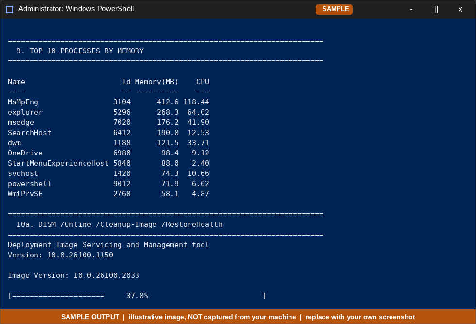
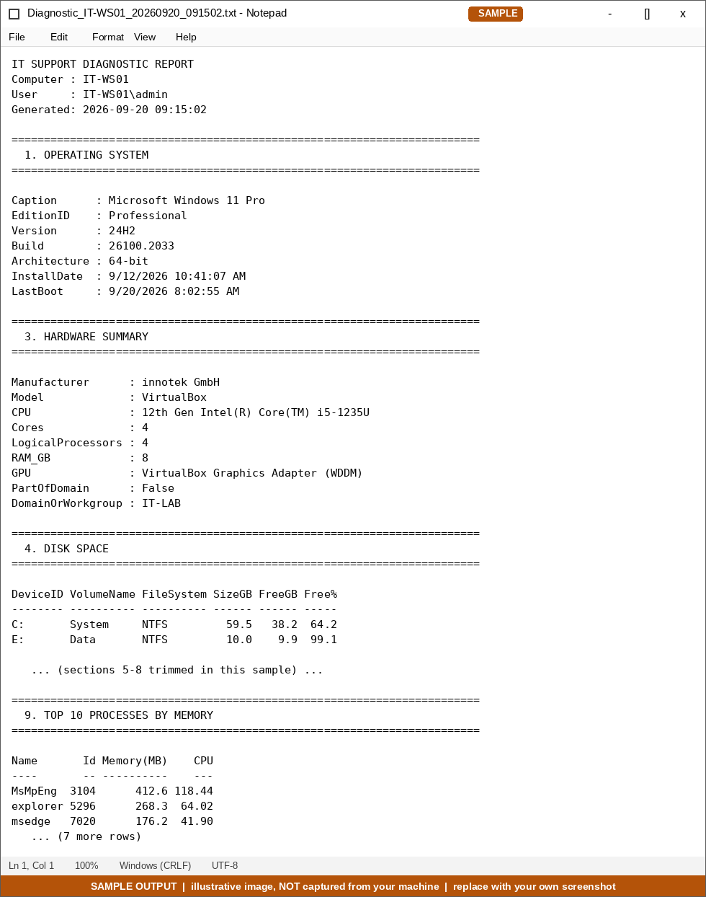

## 1.4 Reading the results

| Tool | Message | Meaning / next step |
|------|---------|---------------------|
| SFC | *"…did not find any integrity violations."* | System files healthy |
| SFC | *"…found corrupt files and successfully repaired them."* | Fixed. Review `CBS.log` if it recurs |
| SFC | *"…found corrupt files but was unable to fix some of them."* | Run `DISM /RestoreHealth`, reboot, run SFC again |
| SFC | *"…could not perform the requested operation."* | Retry from Safe Mode or WinRE |
| DISM | *"The restore operation completed successfully."* | Component store healthy/repaired |
| DISM | Error 0x800f081f (source files not found) | Point DISM at an install media source with `/Source:` |
| CHKDSK | *"Windows has scanned the file system and found no problems."* | File system consistent |
| CHKDSK | Errors found | Schedule an offline fix: `chkdsk C: /f /r` (needs a reboot for the system drive) |

> `chkdsk C: /scan` is used in the script because it is a **read-only online** scan. Repairing the system drive (`/f /r`) requires a restart and can take hours, so it is left as a deliberate manual step.

📸 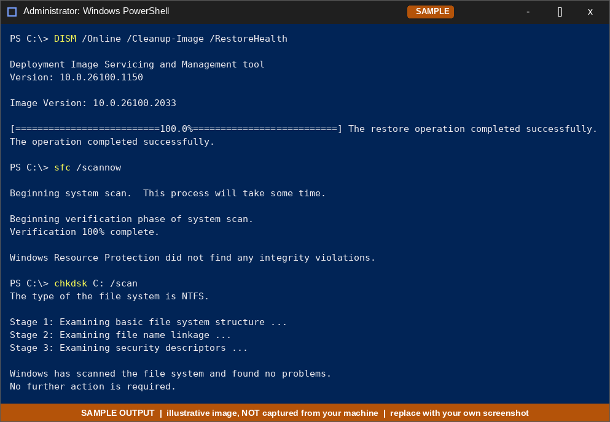

## 1.5 Why file system type matters

The script prints the file system of every drive using `fsutil fsinfo volumeinfo`. Example command for one drive:

```powershell
fsutil fsinfo volumeinfo C:\
# look for the line:  File System Name : NTFS
```

| File system | Max file size | Permissions / encryption | Typical use |
|-------------|--------------|--------------------------|-------------|
| **NTFS** | Very large (practically unlimited) | ACLs, EFS, BitLocker, compression, journaling | Windows system and data drives |
| **FAT32** | 4 GB per file (volume ≤ 2 TB; Windows formats ≤ 32 GB) | None | Small/legacy USB sticks, firmware media, UEFI boot partitions (ESP) |
| **exFAT** | Very large | None | Large USB drives / SD cards shared between Windows and macOS |

**Support tip:** if a user can't copy a 6 GB file to a USB stick, check whether it's FAT32 (4 GB limit). Reformat as exFAT (or NTFS if Windows-only).

📸 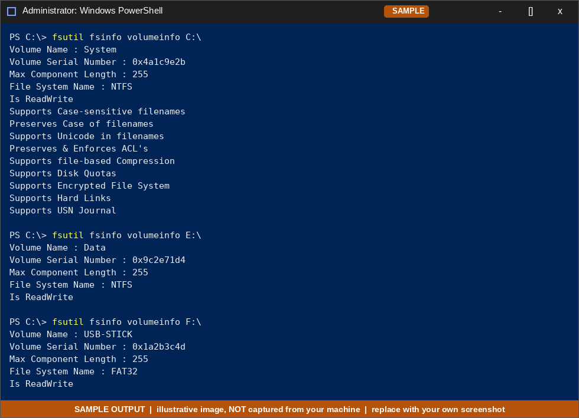

## 1.6 Boot method: UEFI vs Legacy BIOS

Three ways to check (the script does all of them):

| Method | Command | UEFI result | Legacy result |
|--------|---------|-------------|---------------|
| System Information | `msinfo32` → **BIOS Mode** | `UEFI` | `Legacy` |
| Boot configuration | `bcdedit /enum '{current}'` → `path` | `\WINDOWS\system32\winload.efi` | `\WINDOWS\system32\winload.exe` |
| PowerShell | `(Get-ComputerInfo).BiosFirmwareType` | `Uefi` | `Legacy` |
| Secure Boot | `Confirm-SecureBootUEFI` | `True` / `False` | Throws "not supported" |

Related fact: **GPT** disks are used with UEFI, **MBR** disks with Legacy BIOS. This matters when reinstalling Windows or converting disks (`mbr2gpt /validate /allowFullOS`).

📸 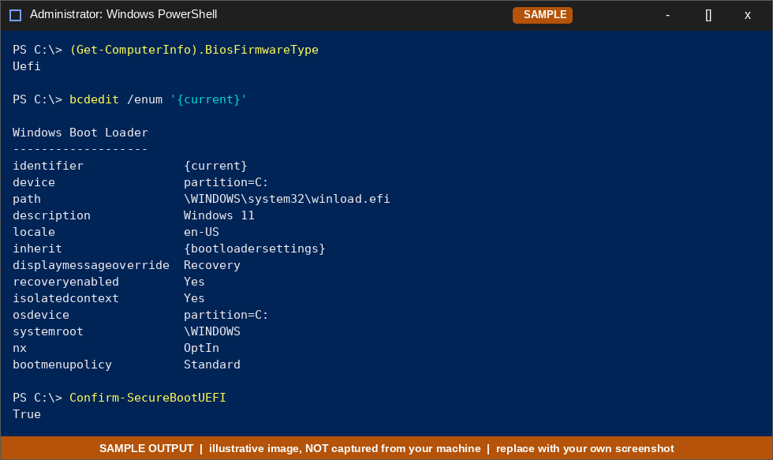

---

# Part 2: New Employee Onboarding

Onboarding a new hire, `jsmith`, onto a workstation. Steps 2.1 – 2.6.

## 2.1 Create a standard (non-admin) local user

**Command Prompt / PowerShell (elevated):**

```cmd
:: '*' makes Windows prompt for the password so it isn't stored in command history
net user jsmith * /add /fullname:"John Smith" /comment:"New hire - IT Support"

:: force a password change at first sign-in
net user jsmith /logonpasswordchg:yes
```

`net user … /add` places the account in the **Users** group (standard user). It is *not* added to **Administrators**.

**PowerShell equivalent:**

```powershell
$pw = Read-Host -AsSecureString "Temporary password"
New-LocalUser -Name "jsmith" -Password $pw -FullName "John Smith" -Description "New hire - IT Support"
Add-LocalGroupMember -Group "Users" -Member "jsmith"
```

**Verify the account is standard, not admin:**

```cmd
net user jsmith
net localgroup Users
net localgroup Administrators
```
```powershell
Get-LocalGroupMember -Group "Users"          # jsmith should be listed
Get-LocalGroupMember -Group "Administrators" # jsmith should NOT be listed
```
Functional test: sign in as `jsmith` and try to install software or open an elevated prompt. UAC should demand **administrator credentials**.

📸 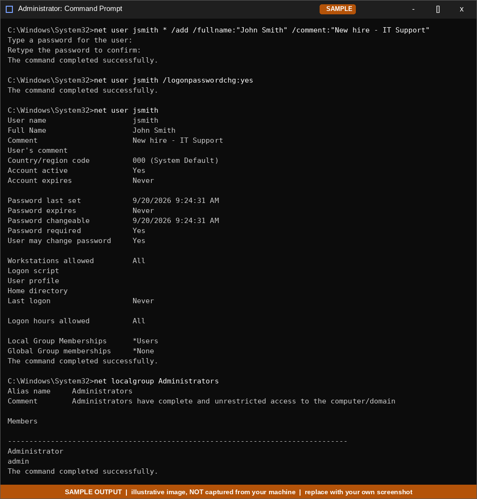

## 2.2 Partition a test disk (VM only)

> ⚠️ **Do this only in a VM.** Take a snapshot first. The example shrinks `C:` by 10 GB, then uses the free space for a new NTFS volume.

| Step | Action | Command / GUI |
|------|--------|---------------|
| 1 | Inspect the current layout | `diskmgmt.msc` or `Get-Volume`, `Get-Disk` |
| 2 | Check how far `C:` can shrink | `Get-PartitionSupportedSize -DriveLetter C` |
| 3 | Shrink `C:` by 10 GB | diskpart: `shrink desired=10240` |
| 4 | Create a partition in the freed space | diskpart: `create partition primary` |
| 5 | Format as NTFS | diskpart: `format fs=ntfs quick label="Data"` |
| 6 | Assign a drive letter | diskpart: `assign letter=E` |
| 7 | Verify | `list volume`, `Get-Volume`, `fsutil fsinfo volumeinfo E:\` |

**diskpart session:**

```
diskpart
DISKPART> list volume
DISKPART> select volume C
DISKPART> shrink desired=10240 minimum=5120     # sizes are in MB
DISKPART> list disk
DISKPART> select disk 0
DISKPART> create partition primary
DISKPART> format fs=ntfs quick label="Data"
DISKPART> assign letter=E
DISKPART> list volume
DISKPART> exit
```

**PowerShell equivalent:**

```powershell
# shrink C: by 10 GB
$c = Get-Partition -DriveLetter C
Resize-Partition -DriveLetter C -Size ($c.Size - 10GB)

# create + format + assign in one pipeline
New-Partition -DiskNumber 0 -UseMaximumSize -DriveLetter E |
    Format-Volume -FileSystem NTFS -NewFileSystemLabel "Data" -Confirm:$false

Get-Volume -DriveLetter E
```

> `-UseMaximumSize` uses the largest contiguous free block. If the disk has other unallocated regions (e.g. after a recovery partition), specify `-Size 10GB` instead.

**GUI method (Disk Management):** right-click `C:` → *Shrink Volume…* → enter MB → right-click *Unallocated* → *New Simple Volume…* → NTFS → letter `E:`.

**Troubleshooting:** if `C:` can't shrink as far as expected, immovable files (page file, hibernation file, shadow copies) sit at the end of the volume. Temporarily disable the page file / hibernation (`powercfg /h off`) and retry.

📸 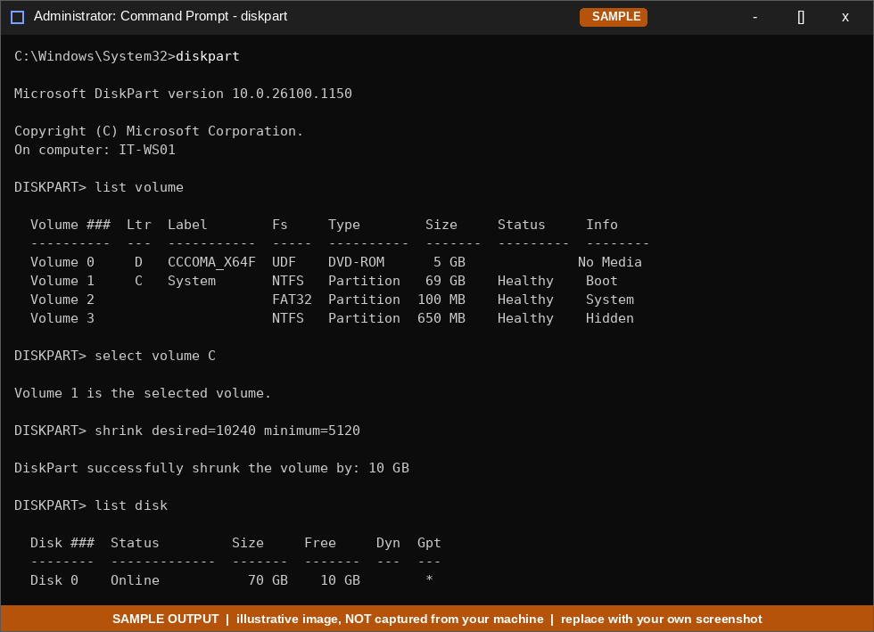
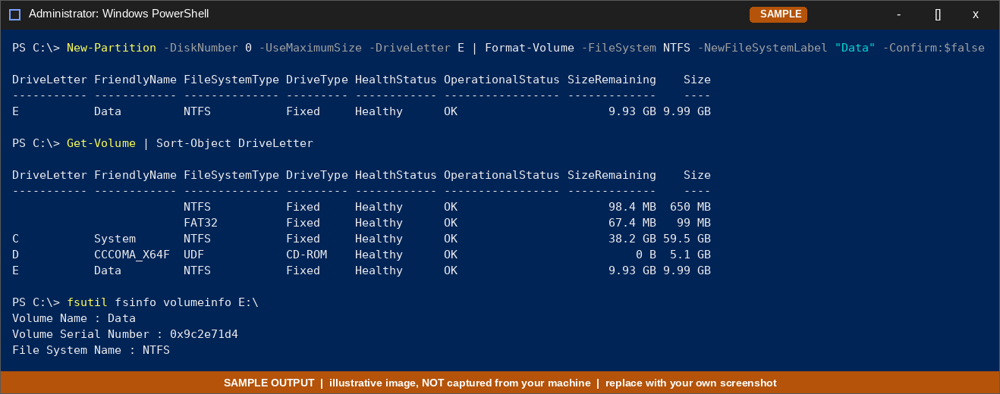

## 2.3 Configure Windows Update pause policy

**Method A: Settings (per-user convenience, temporary):**
Settings → *Windows Update* → *Pause updates* → choose a duration (up to 5 weeks).

**Method B: Update deferral policy (documented registry policy, what Group Policy writes):**
Group Policy path: *Computer Configuration → Administrative Templates → Windows Components → Windows Update → Manage updates offered from Windows Update*.

```powershell
$wu = 'HKLM:\SOFTWARE\Policies\Microsoft\Windows\WindowsUpdate'
New-Item -Path $wu -Force | Out-Null

# Delay quality (monthly) updates 7 days, feature updates 30 days
New-ItemProperty -Path $wu -Name DeferQualityUpdates             -PropertyType DWord -Value 1  -Force | Out-Null
New-ItemProperty -Path $wu -Name DeferQualityUpdatesPeriodInDays -PropertyType DWord -Value 7  -Force | Out-Null
New-ItemProperty -Path $wu -Name DeferFeatureUpdates             -PropertyType DWord -Value 1  -Force | Out-Null
New-ItemProperty -Path $wu -Name DeferFeatureUpdatesPeriodInDays -PropertyType DWord -Value 30 -Force | Out-Null

gpupdate /force
```

**Method C: Scripted "pause" (writes the same values the Settings page uses):**

```powershell
$days  = 14
$fmt   = "yyyy-MM-ddTHH:mm:ssZ"
$start = (Get-Date).ToUniversalTime()
$end   = $start.AddDays($days)
$ux    = 'HKLM:\SOFTWARE\Microsoft\WindowsUpdate\UX\Settings'

$values = @{
    PauseUpdatesStartTime          = $start.ToString($fmt)
    PauseUpdatesExpiryTime         = $end.ToString($fmt)
    PauseFeatureUpdatesStartTime   = $start.ToString($fmt)
    PauseFeatureUpdatesEndTime     = $end.ToString($fmt)
    PauseQualityUpdatesStartTime   = $start.ToString($fmt)
    PauseQualityUpdatesEndTime     = $end.ToString($fmt)
}
foreach ($k in $values.Keys) {
    New-ItemProperty -Path $ux -Name $k -PropertyType String -Value $values[$k] -Force | Out-Null
}
```

> Method C uses the values the Settings UI stores; they are not a formally documented API and can differ between Windows builds. **Always confirm in Settings** that it now says *"Updates paused until …"*. For managed fleets, prefer Method B (policy).

**Verify:**

```powershell
Get-ItemProperty 'HKLM:\SOFTWARE\Policies\Microsoft\Windows\WindowsUpdate' |
    Select-Object DeferQualityUpdates*, DeferFeatureUpdates*
Get-ItemProperty 'HKLM:\SOFTWARE\Microsoft\WindowsUpdate\UX\Settings' |
    Select-Object PauseUpdatesExpiryTime, PauseFeatureUpdatesEndTime, PauseQualityUpdatesEndTime
```
Then open *Settings → Windows Update* and check the banner.

**Undo:**
```powershell
Remove-Item 'HKLM:\SOFTWARE\Policies\Microsoft\Windows\WindowsUpdate' -Recurse -Force
gpupdate /force
```
(Or click *Resume updates* in Settings for Method A/C.)

📸 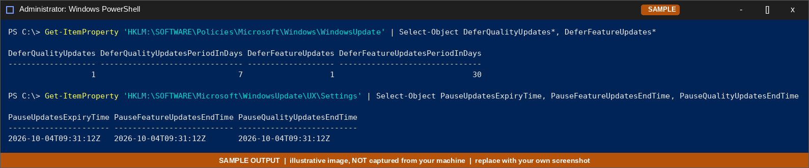

## 2.4 Create + verify a System Restore point (command line)

System Restore must be enabled on the drive. `Checkpoint-Computer` runs in **Windows PowerShell 5.1** (not PowerShell 7).

```powershell
# 1. Enable System Protection on C:
Enable-ComputerRestore -Drive "C:\"

# 2. (Optional) cap the space it may use
vssadmin resize shadowstorage /for=C: /on=C: /maxsize=5%

# 3. Create the restore point
Checkpoint-Computer -Description "Onboarding baseline - IT-WS01" -RestorePointType MODIFY_SETTINGS

# 4. Verify
Get-ComputerRestorePoint |
    Format-Table SequenceNumber, CreationTime, Description, RestorePointType -AutoSize
vssadmin list shadows
```

**Windows limits restore points to one per 24 hours by default.** For testing, lift the throttle:

```powershell
New-ItemProperty -Path 'HKLM:\SOFTWARE\Microsoft\Windows NT\CurrentVersion\SystemRestore' `
    -Name SystemRestorePointCreationFrequency -PropertyType DWord -Value 0 -Force
```

**Roll back (from CLI or GUI):**
```powershell
Restore-Computer -RestorePoint <SequenceNumber> -Confirm   # reboots the machine
# GUI: rstrui.exe
```

📸 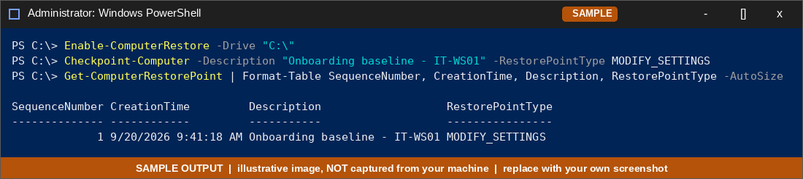

## 2.5 Personalize the workstation: GUI vs PowerShell

**Goal:** switch Windows and apps to **dark mode**, then set the desktop wallpaper.

### Method 1: Settings (GUI)
1. *Settings → Personalization → Colors*
2. *Choose your mode* → **Dark**
3. *Settings → Personalization → Background* → choose a picture

📸 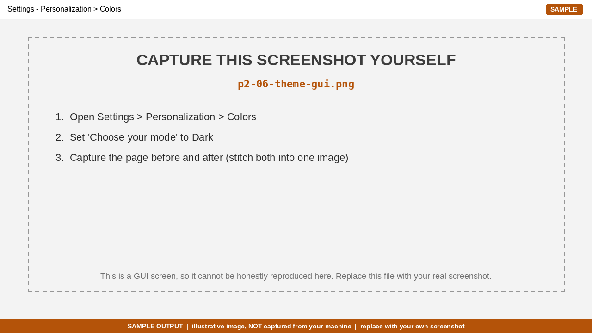

### Method 2: PowerShell / registry

```powershell
# Dark mode: 0 = dark, 1 = light
$p = 'HKCU:\Software\Microsoft\Windows\CurrentVersion\Themes\Personalize'
Set-ItemProperty -Path $p -Name AppsUseLightTheme    -Value 0
Set-ItemProperty -Path $p -Name SystemUsesLightTheme -Value 0

# Wallpaper (applies immediately)
Add-Type @"
using System.Runtime.InteropServices;
public class Wallpaper {
    [DllImport("user32.dll", CharSet = CharSet.Auto)]
    public static extern int SystemParametersInfo(int uAction, int uParam, string lpvParam, int fuWinIni);
}
"@
# 20 = SPI_SETDESKWALLPAPER, 3 = update user profile + broadcast change
[Wallpaper]::SystemParametersInfo(20, 0, "C:\Windows\Web\Wallpaper\Windows\img0.jpg", 3) | Out-Null
```

Some shell elements only redraw after Explorer restarts:
```powershell
Stop-Process -Name explorer -Force   # Explorer restarts automatically
```

Revert to light: set both values to `1`.

📸 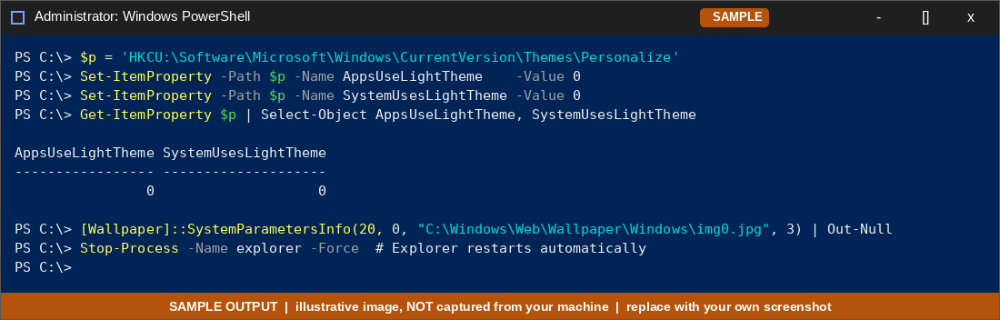

### Comparison

| Aspect | Settings (GUI) | PowerShell / registry |
|--------|----------------|-----------------------|
| Speed for one PC | Fast, intuitive | Slower to write the first time |
| Repeatability | Manual clicks every time | Identical result every run |
| Scale (50 new PCs) | Impractical | Push via logon script / Intune / GPO |
| Documentation & audit | Screenshots only | The script *is* the documentation |
| Risk of mistakes | Low (guard-rails, validation) | Higher: typos in registry paths can break things |
| Discoverability | Options are visible | Must know the key names |
| Immediate effect | Yes | Mostly; some items need Explorer restart or sign-out |
| Scope | Current user | Current user (`HKCU`), or all users via `HKLM`/default profile |

**Takeaway:** use the GUI to *discover* a setting (and watch which registry value changes with tools like Process Monitor), then use PowerShell to *deploy* it consistently.

## 2.6 Security setting via Control Panel: BitLocker (+ Defender scan schedule)

### A. BitLocker on the new data volume (`E:`): Control Panel method

Requires **Windows Pro/Enterprise/Education**. Encrypting a *data* drive works without a TPM.

1. *Control Panel → System and Security → **BitLocker Drive Encryption***
2. *Turn on BitLocker* next to drive `E:`
3. Choose a password to unlock the drive
4. **Back up the recovery key** (to a file/print, never commit it to Git)
5. Choose *Used disk space only* (new/empty drive) → *New encryption mode* → *Start encrypting*

📸 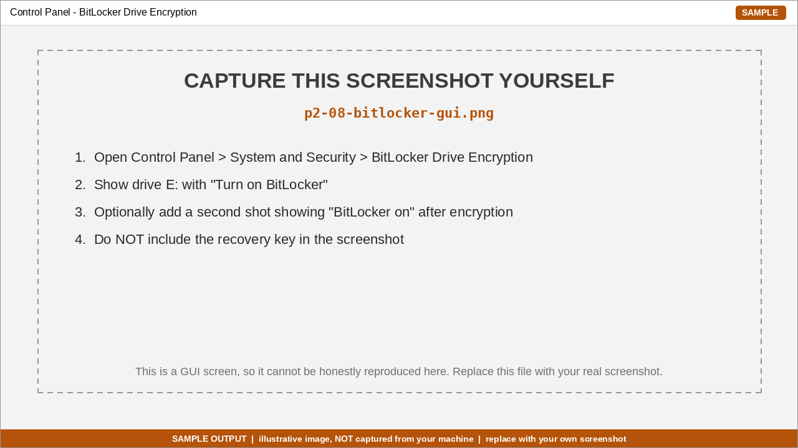

**Verify from the command line:**

```powershell
manage-bde -status E:
Get-BitLockerVolume -MountPoint E: | Format-List MountPoint, VolumeStatus, EncryptionPercentage, ProtectionStatus, KeyProtector
```
Expected: `Conversion Status: Fully Encrypted` (or `Used Space Only Encrypted`), `Protection Status: Protection On`.

**CLI-only equivalent (for reference):**
```powershell
Enable-BitLocker -MountPoint E: -RecoveryPasswordProtector -UsedSpaceOnly
manage-bde -protectors -get E:      # shows the recovery password; store it securely
```

### B. Microsoft Defender: scheduled scan (verified via PowerShell)

The scan schedule is edited through Task Scheduler (*Task Scheduler Library → Microsoft → Windows → Windows Defender → Windows Defender Scheduled Scan*) or Group Policy; PowerShell is the quickest to script and verify:

```powershell
# 0 = every day, 1 = Sunday … 7 = Saturday, 8 = never
Set-MpPreference -ScanScheduleDay 0
Set-MpPreference -ScanScheduleTime 02:00:00
Set-MpPreference -ScanParameters QuickScan      # or FullScan

# Verify
Get-MpPreference | Select-Object ScanScheduleDay, ScanScheduleTime, ScanParameters
Get-MpComputerStatus | Select-Object RealTimeProtectionEnabled, AntivirusSignatureLastUpdated, QuickScanEndTime

# Trigger a scan on demand to prove Defender is working
Start-MpScan -ScanType QuickScan
```
> If a third-party antivirus is installed, Defender may be in passive mode and these settings will not apply.

📸 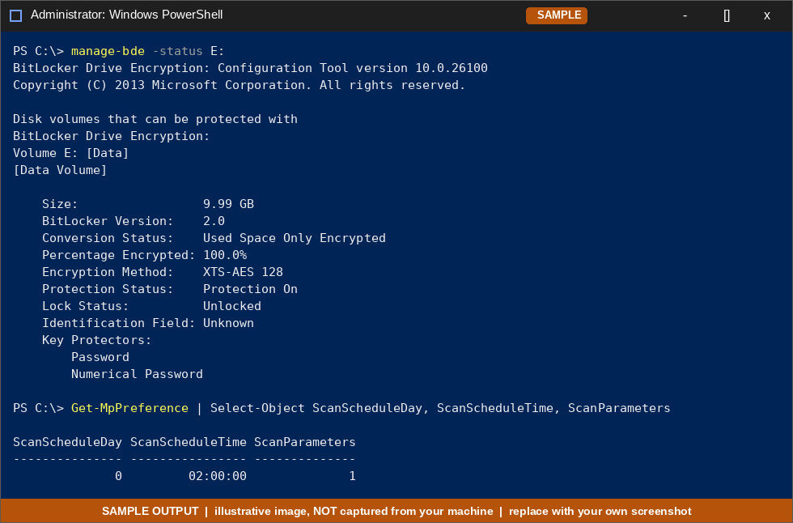

---

# Part 5: Application Lifecycle

**Example app:** [7-Zip](https://www.7-zip.org/), which publishes both an `.exe` (NSIS) and an `.msi` installer, so both silent-install styles can be tested. Replace `<version>` with the file you downloaded. For section 5.4 the portable-vs-installer comparison uses **Notepad++**, which offers both an installer and a portable `.zip`.

## 5.1 Install one app silently

```powershell
# --- EXE (NSIS) installer: /S = silent, /D= sets install dir (must be last, no quotes)
$p = Start-Process .\7z<version>-x64.exe -ArgumentList '/S','/D=C:\Program Files\7-Zip' -Wait -PassThru
"Exit code: $($p.ExitCode)"

# --- MSI installer: /qn = no UI, /norestart, /L*v = verbose log
$p = Start-Process msiexec.exe -ArgumentList '/i','.\7z<version>-x64.msi','/qn','/norestart','/L*v','.\7zip-install.log' -Wait -PassThru
"Exit code: $($p.ExitCode)"          # 0 = success, 3010 = success, reboot required

# --- Package manager alternative
winget install --id 7zip.7zip --silent --accept-package-agreements --accept-source-agreements
```

**Verify:**
```powershell
Test-Path "C:\Program Files\7-Zip\7z.exe"
Get-ItemProperty 'HKLM:\SOFTWARE\Microsoft\Windows\CurrentVersion\Uninstall\*' |
    Where-Object DisplayName -like '*7-Zip*' | Select-Object DisplayName, DisplayVersion, UninstallString
& "C:\Program Files\7-Zip\7z.exe" | Select-Object -First 3
```

| Installer type | Silent switches |
|----------------|-----------------|
| MSI | `/qn /norestart` (+ `/L*v log`) |
| NSIS (.exe) | `/S` (case-sensitive) |
| Inno Setup (.exe) | `/VERYSILENT /SUPPRESSMSGBOXES /NORESTART` |
| InstallShield | `/s /v"/qn"` |
| Unknown | `setup.exe /?` or `/help`, or check the vendor's deployment docs |

📸 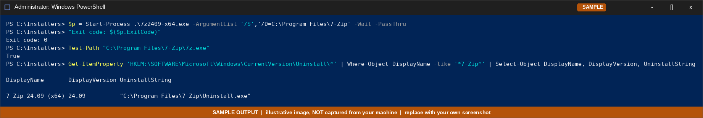

## 5.2 Fully uninstall & verify no leftovers

**Uninstall silently:**
```powershell
# EXE-based (NSIS) uninstaller
Start-Process "C:\Program Files\7-Zip\Uninstall.exe" -ArgumentList '/S' -Wait

# MSI-based: find the product code, then remove it
$prod = Get-ItemProperty 'HKLM:\SOFTWARE\Microsoft\Windows\CurrentVersion\Uninstall\*' |
        Where-Object DisplayName -like '*7-Zip*'
$prod.PSChildName                                   # e.g. {23170F69-40C1-278A-1000-000100020000}
msiexec /x $prod.PSChildName /qn /norestart /L*v uninstall.log

# Package manager
winget uninstall --id 7zip.7zip --silent
```

### Leftover checker: `Test-AppLeftovers.ps1`

```powershell
<#
.SYNOPSIS  Search common locations for leftovers of an uninstalled app.
.EXAMPLE   .\Test-AppLeftovers.ps1 -AppName "7-Zip"
#>
param([Parameter(Mandatory)][string]$AppName)

$found = New-Object System.Collections.Generic.List[string]

# 1. Files & folders
$fileRoots = @(
    $env:ProgramFiles, ${env:ProgramFiles(x86)}, $env:ProgramData,
    $env:APPDATA, $env:LOCALAPPDATA, "$env:USERPROFILE\AppData\LocalLow",
    "$env:ProgramData\Microsoft\Windows\Start Menu\Programs",
    "$env:APPDATA\Microsoft\Windows\Start Menu\Programs",
    "$env:PUBLIC\Desktop", "$env:USERPROFILE\Desktop"
) | Where-Object { $_ -and (Test-Path $_) }

foreach ($root in $fileRoots) {
    Get-ChildItem -Path $root -Recurse -Depth 3 -Force -ErrorAction SilentlyContinue |
        Where-Object Name -like "*$AppName*" |
        ForEach-Object { $found.Add("FILE      $($_.FullName)") }
}

# 2. Registry: vendor keys
foreach ($root in 'HKLM:\SOFTWARE', 'HKLM:\SOFTWARE\WOW6432Node', 'HKCU:\SOFTWARE') {
    Get-ChildItem $root -ErrorAction SilentlyContinue |
        Where-Object PSChildName -like "*$AppName*" |
        ForEach-Object { $found.Add("REGISTRY  $($_.Name)") }
}

# 3. Registry: Add/Remove Programs entries
$un = 'HKLM:\SOFTWARE\Microsoft\Windows\CurrentVersion\Uninstall\*',
      'HKLM:\SOFTWARE\WOW6432Node\Microsoft\Windows\CurrentVersion\Uninstall\*',
      'HKCU:\SOFTWARE\Microsoft\Windows\CurrentVersion\Uninstall\*'
Get-ItemProperty $un -ErrorAction SilentlyContinue |
    Where-Object { $_.DisplayName -like "*$AppName*" } |
    ForEach-Object { $found.Add("UNINSTALL $($_.DisplayName)") }

# 4. Services, scheduled tasks, PATH entries
Get-Service -ErrorAction SilentlyContinue |
    Where-Object { $_.Name -like "*$AppName*" -or $_.DisplayName -like "*$AppName*" } |
    ForEach-Object { $found.Add("SERVICE   $($_.Name)") }
Get-ScheduledTask -ErrorAction SilentlyContinue |
    Where-Object TaskName -like "*$AppName*" |
    ForEach-Object { $found.Add("TASK      $($_.TaskName)") }
($env:Path -split ';') | Where-Object { $_ -like "*$AppName*" } |
    ForEach-Object { $found.Add("PATH      $_") }

# Result
if ($found.Count -eq 0) {
    Write-Host "CLEAN: no leftovers found for '$AppName'." -ForegroundColor Green
} else {
    Write-Host "LEFTOVERS FOUND for '$AppName' ($($found.Count)):" -ForegroundColor Yellow
    $found | Sort-Object | ForEach-Object { Write-Host "  $_" }
}
```

Extra manual registry search (slow but thorough):
```cmd
reg query HKLM\SOFTWARE /s /f "7-Zip" /k
reg query HKCU\SOFTWARE /s /f "7-Zip" /k
```

**What leftovers are normal?** User settings under `HKCU\Software\<vendor>` and `%APPDATA%` are commonly kept by design. If a *clean* removal is required, delete them after confirming the paths:
```powershell
Remove-Item "$env:APPDATA\7-Zip" -Recurse -Force -ErrorAction SilentlyContinue
Remove-Item 'HKCU:\Software\7-Zip' -Recurse -Force -ErrorAction SilentlyContinue
```
If a shell-extension DLL (context menu) is still locked, **restart Explorer or sign out** and retry.

📸 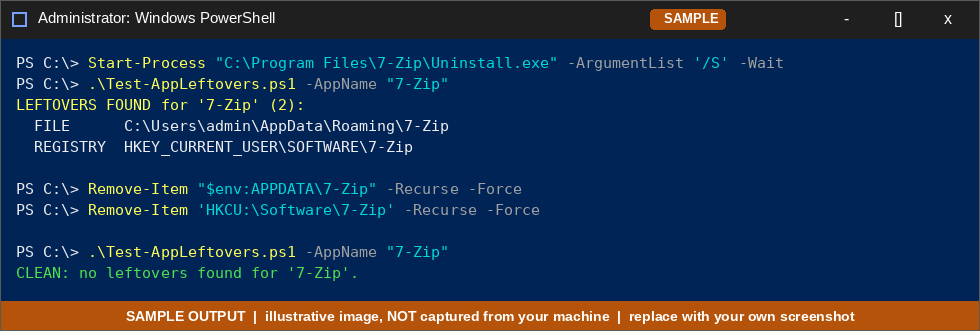

## 5.3 Check an app's requirements before installing

Compare the vendor's **minimum requirements** with the machine's specs from the Part 1 report (`3. HARDWARE SUMMARY`, `4. DISK SPACE`, `1. OPERATING SYSTEM`).

**Manual comparison table (fill in with the real vendor values):**

| Requirement | App minimum (from vendor site) | This machine (Part 1 report) | Pass? |
|-------------|-------------------------------|------------------------------|-------|
| OS / build | e.g. Windows 10 22H2 (build 19045) or later | Report §1 | ✅/❌ |
| Architecture | e.g. 64-bit | Report §1 | ✅/❌ |
| CPU cores | e.g. 2 | Report §3 | ✅/❌ |
| RAM | e.g. 4 GB | Report §3 | ✅/❌ |
| Free disk | e.g. 5 GB | Report §4 | ✅/❌ |
| Other | GPU, .NET/VC++ runtime, TPM, internet, admin rights | n/a | ✅/❌ |

**Automated: `Test-AppRequirements.ps1`** (the defaults below are examples. Pass the vendor's real numbers as parameters):

```powershell
<#
.SYNOPSIS  Compare this machine to an app's minimum requirements.
.EXAMPLE   .\Test-AppRequirements.ps1 -MinBuild 19045 -MinRamGB 8 -MinFreeDiskGB 10 -MinCores 4
#>
param(
    [int]$MinBuild          = 19045,
    [double]$MinRamGB       = 4,
    [double]$MinFreeDiskGB  = 5,
    [int]$MinCores          = 2,
    [ValidateSet('64-bit','32-bit')][string]$Arch = '64-bit'
)

$os    = Get-CimInstance Win32_OperatingSystem
$cs    = Get-CimInstance Win32_ComputerSystem
$cpu   = Get-CimInstance Win32_Processor | Select-Object -First 1
$disk  = Get-CimInstance Win32_LogicalDisk -Filter "DeviceID='$env:SystemDrive'"
$build = [int](Get-ItemProperty 'HKLM:\SOFTWARE\Microsoft\Windows NT\CurrentVersion').CurrentBuild
$ramGB = [math]::Round($cs.TotalPhysicalMemory / 1GB, 1)
$freeGB= [math]::Round($disk.FreeSpace / 1GB, 1)

$checks = @(
    [pscustomobject]@{ Requirement='Windows build';  Required=">= $MinBuild"; Actual=$build;               Pass=($build -ge $MinBuild) }
    [pscustomobject]@{ Requirement='Architecture';   Required=$Arch;          Actual=$os.OSArchitecture;   Pass=($os.OSArchitecture -eq $Arch) }
    [pscustomobject]@{ Requirement='CPU cores';      Required=">= $MinCores"; Actual=$cpu.NumberOfCores;   Pass=($cpu.NumberOfCores -ge $MinCores) }
    [pscustomobject]@{ Requirement='RAM (GB)';       Required=">= $MinRamGB"; Actual=$ramGB;               Pass=($ramGB -ge $MinRamGB) }
    [pscustomobject]@{ Requirement='Free disk (GB)'; Required=">= $MinFreeDiskGB"; Actual=$freeGB;        Pass=($freeGB -ge $MinFreeDiskGB) }
)
$checks | Format-Table -AutoSize

if ($checks.Pass -contains $false) {
    Write-Host 'RESULT: machine does NOT meet the minimum requirements.' -ForegroundColor Red; exit 1
} else {
    Write-Host 'RESULT: machine meets the minimum requirements.' -ForegroundColor Green
}
```

📸 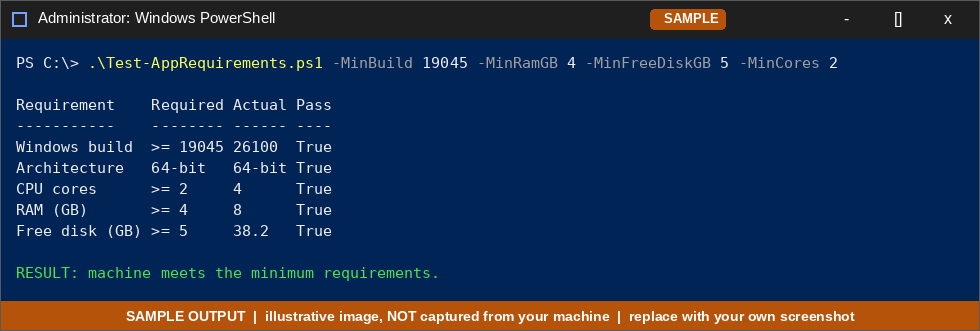

## 5.4 Distribution methods: installer vs portable

Test with **Notepad++** (available as a normal installer *and* as a portable `.zip`):

```powershell
# A) Installer (NSIS): silent
Start-Process .\npp.<version>.Installer.x64.exe -ArgumentList '/S' -Wait
Get-ItemProperty 'HKLM:\SOFTWARE\Microsoft\Windows\CurrentVersion\Uninstall\*' |
    Where-Object DisplayName -like '*Notepad++*' | Select-Object DisplayName, UninstallString   # entry exists

# B) Portable: just extract and run
Expand-Archive .\npp.<version>.portable.x64.zip -DestinationPath C:\Tools\NotepadPP-Portable
Start-Process C:\Tools\NotepadPP-Portable\notepad++.exe
Get-ItemProperty 'HKLM:\SOFTWARE\Microsoft\Windows\CurrentVersion\Uninstall\*' |
    Where-Object DisplayName -like '*Notepad++*'          # (portable copy adds no entry)

# Removing the portable copy = deleting the folder
Remove-Item C:\Tools\NotepadPP-Portable -Recurse -Force
```

| | **Installer (.exe / .msi)** | **Portable / no-install** |
|---|---|---|
| Admin rights | Usually required (Program Files, HKLM) | Often not required |
| System integration | File associations, context menu, Start Menu, services, PATH | None (or manual) |
| Registry footprint | Yes: Uninstall entry, settings | Minimal or none |
| Updates | Auto-updater / MSI upgrades / winget / SCCM / Intune | Manual replace of the folder |
| Uninstall | Standard, tracked, scriptable | Delete the folder; settings may remain in its own folder |
| Enterprise deployment | Excellent (MSI + GPO/Intune, silent switches, inventory) | Poor: no inventory or compliance tracking |
| Runs from USB / no trace on host | No | Yes |
| Dependencies (runtimes) | Installer can bundle/install them | Must already exist on the machine |
| Security / licensing audit | Visible in software inventory | Invisible to inventory tools, which is a risk for IT |

**Rule of thumb:** installers for managed, supported, inventoried software; portable for quick troubleshooting tools, USB toolkits, or restricted machines where you cannot install.

📸 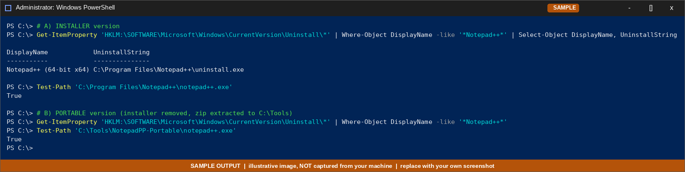

## 5.5 Configure app permissions / security: restrict access and run as a limited user

**Scenario:** a folder `C:\Restricted` must be readable only by administrators. Prove that the standard user `jsmith` (and apps launched as `jsmith`) cannot access it.

```powershell
# 1. Create a test folder with a file
New-Item C:\Restricted -ItemType Directory -Force | Out-Null
"confidential" | Set-Content C:\Restricted\secret.txt

# 2. Remove inherited permissions, then grant only Administrators + SYSTEM
icacls C:\Restricted /inheritance:r
icacls C:\Restricted /grant "Administrators:(OI)(CI)F" /grant "SYSTEM:(OI)(CI)F"

# 3. Review the ACL
icacls C:\Restricted
(Get-Acl C:\Restricted).Access | Format-Table IdentityReference, FileSystemRights, AccessControlType -AutoSize
```

**Test as the limited user** (from the admin session):

```cmd
runas /user:%COMPUTERNAME%\jsmith cmd
:: in the new window
whoami
dir C:\Restricted
type C:\Restricted\secret.txt
```
Expected: `Access is denied.`

**Run an app under the limited account and prove it:**

```cmd
runas /user:%COMPUTERNAME%\jsmith notepad.exe
```
```powershell
Get-Process notepad -IncludeUserName | Select-Object Name, UserName      # UserName = IT-WS01\jsmith
```
In that Notepad, *File → Open* `C:\Restricted\secret.txt` → the app inherits the user's restriction and is blocked.

**Variation: read-only access.** Give `jsmith` read but not write:
```powershell
icacls C:\Restricted /grant "jsmith:(OI)(CI)R"
# as jsmith: type C:\Restricted\secret.txt  → works
# as jsmith: echo x >> C:\Restricted\secret.txt → Access is denied
```

**Undo:** `icacls C:\Restricted /reset /T` (restores inherited permissions) or `Remove-Item C:\Restricted -Recurse -Force`.

**Other ways to restrict apps:** AppLocker / Windows Defender Application Control (allow-list by path/publisher), Software Restriction Policies, Windows Sandbox, and UAC (standard user + "over-the-shoulder" elevation only when needed).

📸 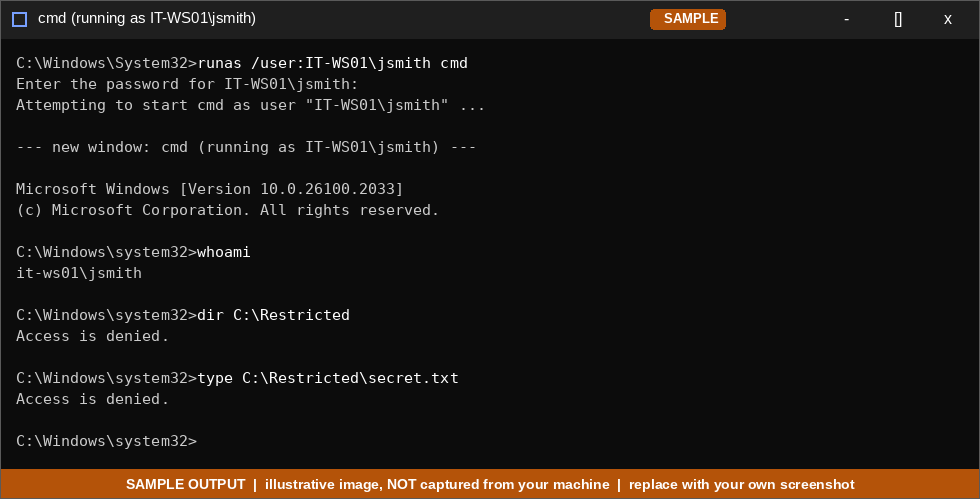

---

← [Back to main README](../README.md) · Next: [networking-notes](../networking-notes/README.md)
